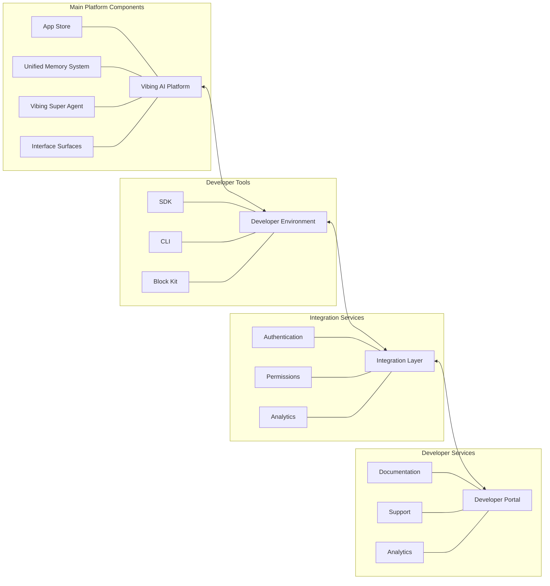

# Vibing AI: Developer Experience & Integration Guide

## 1. Developer Onboarding

### 1.1 Registration & Account Setup

Developers begin by registering through the **Vibing AI** Developer Portal:

1. Create an account with email verification
2. Complete developer profile (individual or organization)
3. Accept platform terms and developer agreement
4. Generate API keys for development

### 1.2 SDK Installation & Setup

Once registered, developers install the SDK:

```bash
# Install the JavaScript SDK
npm install @vibing-ai/sdk

# Install the CLI tools
npm install -g @vibing-ai/cli
```

### 1.3 Documentation Access

Developers receive access to comprehensive documentation:

- Quickstart guides and tutorials
- API reference and SDK documentation
- Component library documentation
- Integration examples and templates
- **Unified Memory System** integration guide
- **Vibing Super Agent** integration documentation

### 1.4 Sandbox Environment

A sandbox environment allows testing without affecting production:

```bash
# Initialize sandbox environment
vibe sandbox init
```

## 2. Development Workflow

### 2.1 Workflow Overview



### 2.2 Project Initialization

Developers initialize new projects using the CLI:

```bash
# Initialize a new app project
vibe init app my-awesome-app

# Initialize a plugin project
vibe init plugin my-productivity-plugin

# Initialize an agent project
vibe init agent my-specialized-agent

# Initialize a theme project
vibe init theme my-beautiful-theme

# Initialize a studio project
vibe init studio my-integrated-studio
```

### 2.3 Local Development

Local development leverages the CLI and SDK:

```bash
# Start local development server
vibe dev

# Run in debug mode
vibe dev --debug

# Build for production
vibe build
```

### 2.4 Version Management

We enforce semantic versioning (MAJOR.MINOR.PATCH):

```bash
# Increment patch version (bug fixes)
vibe version patch

# Increment minor version (non-breaking features)
vibe version minor

# Increment major version (breaking changes)
vibe version major
```

## 3. Testing & Validation

### 3.1 Automated Testing

The platform supports comprehensive automated testing:

```bash
# Run all tests
vibe test

# Run specific test suite
vibe test --suite integration

# Run with coverage
vibe test --coverage
```

### 3.2 Validation & Linting

Built-in validation ensures compatibility:

```bash
# Validate project structure and manifest
vibe validate

# Run linting checks
vibe lint

# Validate against platform requirements
vibe validate --strict
```

### 3.3 Compatibility Testing

Test across surface types and device contexts:

```bash
# Test compatibility across surfaces
vibe test-compatibility

# Preview on different surfaces
vibe preview --surface conversationCard
vibe preview --surface appTab
```

## 4. Submission & Review Process

### 4.1 Submission Preparation

Prepare submission with validation and packaging:

```bash
# Validate before submission
vibe validate --pre-submit

# Package for submission
vibe package
```

### 4.2 Submission Process

Submit through CLI or Developer Portal:

```bash
# Submit through CLI
vibe submit

# Submit specific version
vibe submit --version 1.2.3
```

### 4.3 Review & Approval

The review process includes:

1. Automated validation checks
2. Security review 
3. Policy compliance review
4. Performance testing
5. UX/design review

### 4.4 Publication & Marketplace Listing

Upon approval, developers complete the listing:

- Set pricing and subscription model
- Configure marketplace presentation
- Specify categorization and discovery metadata
- Set up analytics dashboard

## 5. Updates & Maintenance

### 5.1 Update Workflow

Update existing offerings with new versions:

```bash
# Deploy update
vibe update --version 1.0.1

# Stage update for testing
vibe update --stage
```

### 5.2 Monitoring & Analytics

Monitor performance and usage:

```bash
# View analytics dashboard
vibe analytics

# Export analytics data
vibe analytics export --format csv
```

### 5.3 User Feedback & Support

Manage user feedback and support:

```bash
# View user feedback
vibe feedback list

# Respond to feedback
vibe feedback respond --id 12345
```

## 6. SDK Documentation

### 6.1 Installation & Setup

```typescript
// Install the SDK
// npm install @vibing-ai/sdk

// Import core modules
import { createApp } from '@vibing-ai/sdk/app';
import { createPlugin } from '@vibing-ai/sdk/plugin';
import { createAgent } from '@vibing-ai/sdk/agent';
import { createTheme } from '@vibing-ai/sdk/theme';
import { createStudio } from '@vibing-ai/sdk/studio';
```

### 6.2 Core Modules & Components

```typescript
// Core modules
import { memory } from '@vibing-ai/sdk/memory';
import { events } from '@vibing-ai/sdk/events';
import { auth } from '@vibing-ai/sdk/auth';
import { permissions } from '@vibing-ai/sdk/permissions';
import { surfaces } from '@vibing-ai/sdk/surfaces';
```

### 6.3 Application Framework

```typescript
// Creating an app
import { createApp } from '@vibing-ai/sdk/app';

const myApp = createApp({
  name: 'My Awesome App',
  description: 'Description of my app',
  version: '1.0.0',
  permissions: [
    'memory:read:conversation;purpose=user_context;ttl=session',
    'memory:write:conversation;purpose=conversation_results;ttl=persistent'
  ],
  surfaces: ['conversationCard', 'appTab'],
  onRender: (container, context) => {
    // Render application
  }
});
```

### 6.4 Plugin Framework

```typescript
// Creating a plugin
import { createPlugin } from '@vibing-ai/sdk/plugin';

const myPlugin = createPlugin({
  name: 'My Productivity Plugin',
  description: 'Enhances productivity',
  version: '1.0.0',
  permissions: [
    'memory:read:global;purpose=user_preferences;ttl=persistent',
    'api:access:calendar;purpose=scheduling;ttl=session'
  ],
  actions: {
    createTask: async (params) => {
      // Implementation
      return { success: true };
    }
  }
});
```

### 6.5 Agent Framework

```typescript
// Creating an agent
import { createAgent } from '@vibing-ai/sdk/agent';

const myAgent = createAgent({
  name: 'Specialized Assistant',
  description: 'Expert in specific domain',
  version: '1.0.0',
  permissions: [
    'memory:read:conversation;purpose=context_analysis;ttl=session',
    'tools:use:web_search;purpose=information_retrieval;ttl=request'
  ],
  capabilities: ['domainExpertise', 'dataAnalysis'],
  onMessage: async (message, context) => {
    // Process message
    return { response: 'Processed response' };
  }
});

// Integrating with Vibing Super Agent
myAgent.on('request', async (req) => {
  // Handle request from Super Agent
});
```

### 6.6 Theme Framework

```typescript
// Creating a theme
import { createTheme } from '@vibing-ai/sdk/theme';
import { colors, typography } from '@vibing-ai/block-kit/theming';

const myTheme = createTheme({
  name: 'Modern Theme',
  description: 'Clean, modern interface',
  version: '1.0.0',
  styles: {
    colors: {
      primary: '#0066cc',
      secondary: '#53a8ff',
      // Additional color definitions
    },
    typography: {
      fontFamily: '"Inter", sans-serif',
      // Typography settings
    },
    components: {
      // Component-specific styling
    }
  }
});
```

### 6.7 Studio Framework

```typescript
// Creating a studio
import { createStudio } from '@vibing-ai/sdk/studio';
import { myApp } from './my-app';
import { myPlugin } from './my-plugin';
import { myAgent } from './my-agent';
import { myTheme } from './my-theme';

const myStudio = createStudio({
  name: 'Integrated Workspace',
  description: 'Complete productivity environment',
  version: '1.0.0',
  components: [
    myApp,
    myPlugin,
    myAgent,
    myTheme
  ],
  configuration: {
    // Studio configuration
  }
});
```

## 7. Authentication & Authorization

### 7.1 Authentication Methods

```typescript
import { auth } from '@vibing-ai/sdk/auth';

// OAuth authentication
const authResponse = await auth.authenticate({
  method: 'oauth',
  clientId: 'your-client-id',
  scopes: ['read', 'write']
});

// API key authentication
auth.setApiKey('your-api-key');
```

### 7.2 Permission Management

```typescript
import { permissions } from '@vibing-ai/sdk/permissions';

// Request permissions
const granted = await permissions.request([
  'memory:read:conversation;purpose=user_context;ttl=session',
  'api:access:calendar;purpose=scheduling;ttl=persistent'
]);

// Check permissions
const hasPermission = await permissions.check('memory:write:global;purpose=user_preferences;ttl=persistent');
```

## 8. Unified Memory System Integration

### 8.1 Memory Operations

```typescript
import { memory } from '@vibing-ai/sdk/memory';

// Store data
await memory.set('user-preferences', { theme: 'dark' });

// Retrieve data
const preferences = await memory.get('user-preferences');

// Update data
await memory.update('user-preferences', { theme: 'light' });

// Delete data
await memory.delete('user-preferences');

// Query data
const results = await memory.query({
  type: 'message',
  filters: {
    conversation: 'current',
    timeRange: { start: '2023-01-01', end: '2023-01-31' }
  }
});
```

### 8.2 Memory Hooks

```typescript
import { useMemory } from '@vibing-ai/sdk/memory/hooks';

// React hook for memory
function UserPreferencesComponent() {
  const [preferences, setPreferences] = useMemory('user-preferences');
  
  // Subscribe to changes
  const [messages, setMessages] = useMemory('conversation-messages', {
    subscribe: true, // Note: Changed from sync:true to subscribe:true
    filters: { conversation: 'current' }
  });
  
  // Component implementation
}
```

### 8.3 Memory Events

```typescript
import { memory } from '@vibing-ai/sdk/memory';

// Listen for memory changes
memory.on('change', (key, newValue, oldValue) => {
  console.log(`Memory changed: ${key}`);
});

// Listen for specific key changes
memory.on('change:user-preferences', (newValue, oldValue) => {
  console.log('User preferences updated');
});
```

## 9. Event System Usage

### 9.1 Platform Events

```typescript
import { events } from '@vibing-ai/sdk/events';

// Subscribe to platform events
events.on('app:launch', (data) => {
  console.log('App launched');
});

events.on('user:login', (userData) => {
  console.log('User logged in');
});
```

### 9.2 Custom Events

```typescript
import { events } from '@vibing-ai/sdk/events';

// Emit custom events
events.emit('my-app:action-completed', { actionId: '12345' });

// Subscribe to custom events
events.on('my-app:action-completed', (data) => {
  console.log(`Action ${data.actionId} completed`);
});
```

### 9.3 Inter-component Communication

```typescript
import { events } from '@vibing-ai/sdk/events';

// App-to-plugin communication
events.emit('request:plugin-action', { 
  plugin: 'my-productivity-plugin',
  action: 'createTask',
  params: { title: 'New Task' }
});

// Listen for plugin responses
events.on('response:plugin-action', (response) => {
  console.log('Plugin action completed', response);
});
```

## 10. Direct API Access

### 10.1 API Client

```typescript
import { api } from '@vibing-ai/sdk/api';

// Make API requests
const response = await api.get('/memory/items', {
  params: { type: 'conversation' }
});

// Post data
const result = await api.post('/plugins/actions', {
  data: {
    plugin: 'my-plugin',
    action: 'createTask',
    params: { title: 'New Task' }
  }
});
```

### 10.2 Pagination & Filtering

```typescript
import { api } from '@vibing-ai/sdk/api';

// Paginated request
const paginatedResponse = await api.get('/memory/items', {
  params: {
    page: 1,
    limit: 20,
    sort: 'createdAt:desc',
    filters: {
      type: 'message',
      timeRange: { start: '2023-01-01' }
    }
  }
});
```

### 10.3 Error Handling

```typescript
import { api } from '@vibing-ai/sdk/api';

try {
  const response = await api.get('/restricted-endpoint');
} catch (error) {
  if (error.status === 401) {
    // Handle authentication error
  } else if (error.status === 403) {
    // Handle permission error
  } else {
    // Handle other errors
    console.error('API Error:', error.message);
  }
}
```

## 11. Interface Surfaces API

### 11.1 Surface Types

The platform supports multiple interface surfaces:

- **Conversation Cards**: Embedded in chat flows
- **App Tabs**: Full application interfaces
- **Intent Chips**: Quick action suggestions
- **Sidebar Panels**: Additional context panels
- **Notification Cards**: Alert and update cards
- **Dashboard Widgets**: Data visualization widgets

### 11.2 Surface Registration

```typescript
import { createApp } from '@vibing-ai/sdk/app';
import { surfaces } from '@vibing-ai/sdk/surfaces';

const myApp = createApp({
  // ...
  surfaces: ['conversationCard', 'appTab', 'sidebarPanel'],
  surfaceSettings: {
    conversationCard: {
      defaultHeight: 'adaptive',
      maxHeight: '500px'
    },
    appTab: {
      icon: './assets/app-icon.png'
    }
  }
});
```

### 11.3 Surface-specific Rendering

```typescript
import { createApp } from '@vibing-ai/sdk/app';
import { surfaces } from '@vibing-ai/sdk/surfaces';

const myApp = createApp({
  // ...
  onRender: (container, context) => {
    const { surface } = context;
    
    if (surface === 'conversationCard') {
      // Render conversation card UI
    } else if (surface === 'appTab') {
      // Render full app tab UI
    } else {
      // Render default UI
    }
  }
});
```

### 11.4 Block Kit Integration

```typescript
import { createApp } from '@vibing-ai/sdk/app';
import { Card, Button, Text } from '@vibing-ai/block-kit';

const myApp = createApp({
  // ...
  onRender: (container) => {
    const card = new Card({
      title: 'My App Card',
      content: [
        new Text('Hello from my app!'),
        new Button('Click me', { onClick: () => alert('Clicked!') })
      ]
    });
    
    card.render(container);
  }
});
```

## 12. API Implementation Roadmap

### 12.1 Stages of Development

The API implementation follows a staged approach:

1. **Stage 1: Foundation** (Current)
   - Core authentication
   - Basic memory operations
   - Simple event system
   - Initial surface rendering

2. **Stage 2: Expansion** (Q3 2023)
   - Enhanced memory querying
   - Advanced event capabilities
   - Extended surface support
   - Improved plugin integration

3. **Stage 3: Maturity** (Q4 2023)
   - Full permissions model
   - Complete memory federation
   - Comprehensive analytics
   - Cross-offering communication

### 12.2 Versioning & Compatibility

We follow semantic versioning with clear compatibility guarantees:

| Version Range | Compatibility Promise |
|---------------|------------------------|
| Same minor version (1.0.x) | Full compatibility, no breaking changes |
| Same major version (1.x.y) | Documented migration path, some breaking changes |
| Across major versions (x.y.z) | Breaking changes expected, migration guide provided |

### 12.3 System Requirements

| Requirement | Minimum | Recommended |
|-------------|---------|-------------|
| Node.js | ≥ 20.6.0 LTS | Latest LTS |
| Browser | Modern evergreen | Chrome, Firefox, Safari, Edge latest |
| Network | HTTPS | HTTPS with HTTP/2 |
| API Latency | < 500ms | < 200ms |
| Infrastructure | Kong Gateway → AWS API Gateway → Fastify on Lambda | Kong Gateway → AWS API Gateway → Fastify on Lambda with optimized settings |

## 13. Block Kit Library

### 13.1 Installation & Setup

```typescript
// Install Block Kit
// npm install @vibing-ai/block-kit

// Import components
import { Card, Button, Input, Text } from '@vibing-ai/block-kit';

// Set up Tailwind integration
// tailwind.config.js
module.exports = {
  // ...
  plugins: [
    require('@vibing-ai/block-kit/tailwind')
  ]
}
```

### 13.2 Core Components

Block Kit provides a robust set of UI components:

```typescript
import { 
  Card, 
  Button, 
  Text, 
  Input, 
  Checkbox, 
  Select, 
  Modal, 
  Tabs,
  Accordion,
  Badge,
  Avatar,
  Icon,
  Spinner
} from '@vibing-ai/block-kit';

// Usage example
const card = new Card({
  title: 'User Profile',
  content: [
    new Avatar({ src: './avatar.png', size: 'large' }),
    new Text('John Doe', { variant: 'heading' }),
    new Badge('Premium', { variant: 'success' }),
    new Button('Edit Profile', { variant: 'primary' })
  ]
});
```

### 13.3 Layout Components

Flexible layout components for complex interfaces:

```typescript
import { 
  Stack, 
  Grid, 
  Container, 
  Divider, 
  Spacer 
} from '@vibing-ai/block-kit/layout';

// Usage example
const layout = new Container({
  children: [
    new Stack({
      direction: 'vertical',
      spacing: 'medium',
      children: [
        new Text('Section Title'),
        new Divider(),
        new Grid({
          columns: 2,
          spacing: 'small',
          children: [
            // Grid items
          ]
        })
      ]
    })
  ]
});
```

### 13.4 Theme Customization

Customize the visual appearance:

```typescript
import { createTheme } from '@vibing-ai/sdk/theme';
import { applyTheme } from '@vibing-ai/block-kit/theming';

const customTheme = createTheme({
  name: 'Corporate Theme',
  styles: {
    colors: {
      primary: '#003366',
      secondary: '#ff9900',
      background: '#f5f7fa',
      text: '#333333'
    },
    typography: {
      fontFamily: '"Segoe UI", system-ui, sans-serif',
      baseSize: '16px'
    },
    spacing: {
      unit: '4px',
      scale: [1, 2, 3, 5, 8, 13]
    },
    // Additional theme settings
  }
});

// Apply theme
applyTheme(customTheme);
```

## 14. CLI Tools

### 14.1 Development Commands

```bash
# Start development server
vibe dev

# Build for production
vibe build

# Run tests
vibe test

# Lint code
vibe lint
```

### 14.2 Deployment Commands

```bash
# Deploy to production
vibe deploy

# Deploy specific version
vibe deploy --version 1.2.3

# Deploy to staging
vibe deploy --env staging
```

### 14.3 Project Management

```bash
# Initialize new project
vibe init [type] [name]

# Update project configuration
vibe config set key=value

# Add dependency
vibe add [dependency]
```

## 15. Integration Patterns

### 15.1 Standalone Application

```typescript
import { createApp } from '@vibing-ai/sdk/app';

const standaloneApp = createApp({
  name: 'Standalone App',
  // ... configuration
  standalone: true,
  onRender: (container) => {
    // Render full application
  }
});
```

### 15.2 Conversational Plugin

```typescript
import { createPlugin } from '@vibing-ai/sdk/plugin';

const conversationalPlugin = createPlugin({
  name: 'Conversational Assistant',
  // ... configuration
  conversational: true,
  onMessage: async (message, context) => {
    // Process message
    return { response: 'Plugin response' };
  }
});
```

### 15.3 Tool Plugin

```typescript
import { createPlugin } from '@vibing-ai/sdk/plugin';

const toolPlugin = createPlugin({
  name: 'Tool Plugin',
  // ... configuration
  tools: [
    {
      name: 'searchDatabase',
      description: 'Search the knowledge database',
      parameters: {
        query: { type: 'string', description: 'Search query' }
      },
      handler: async (params) => {
        // Implement tool functionality
        return { results: [/* search results */] };
      }
    }
  ]
});
```

### 15.4 Agent Integration

```typescript
import { createAgent } from '@vibing-ai/sdk/agent';

const specializedAgent = createAgent({
  name: 'Domain Expert',
  // ... configuration
  expertise: ['domain1', 'domain2'],
  onInvoke: async (request, context) => {
    // Handle invocation from Super Agent
    return { response: 'Specialized knowledge response' };
  }
});
```

## 16. Testing & Quality Assurance

### 16.1 Testing Utilities

```typescript
import { mockMemory, mockEvents } from '@vibing-ai/sdk/testing';

// Mock memory operations
mockMemory({
  'user-preferences': { theme: 'dark' }
});

// Test component using memory
test('Component shows user preferences', async () => {
  const prefs = await memory.get('user-preferences');
  expect(prefs.theme).toBe('dark');
});
```

### 16.2 Simulation Environment

```typescript
import { simulateUser, simulateConversation } from '@vibing-ai/sdk/testing';

// Simulate user interaction
test('App responds to user action', async () => {
  const user = simulateUser();
  await user.click('button#submit');
  expect(user.see('Submission received')).toBe(true);
});

// Simulate conversation
test('Agent responds correctly', async () => {
  const conversation = simulateConversation();
  const response = await conversation.send('Hello agent');
  expect(response.text).toContain('Hello user');
});
```

### 16.3 Performance Testing

```typescript
import { performanceTest } from '@vibing-ai/sdk/testing';

// Test performance
test('Memory operations are performant', async () => {
  const result = await performanceTest({
    operation: () => memory.get('large-dataset'),
    iterations: 100
  });
  
  expect(result.averageTime).toBeLessThan(50); // Under 50ms
});
```

## 17. Compliance & Standards

### 17.1 Accessibility

All interfaces must meet WCAG 2.1 AA standards:

```typescript
import { createApp } from '@vibing-ai/sdk/app';
import { a11yCheck } from '@vibing-ai/sdk/testing';

// Test accessibility
test('Interface meets accessibility standards', async () => {
  const app = createApp({ /* ... */ });
  const a11yIssues = await a11yCheck(app);
  expect(a11yIssues).toHaveLength(0);
});
```

### 17.2 Internationalization

Support for multiple languages and locales:

```typescript
import { createApp } from '@vibing-ai/sdk/app';
import { i18n } from '@vibing-ai/sdk/i18n';

// Load translations
i18n.load({
  en: { greeting: 'Hello' },
  es: { greeting: 'Hola' },
  fr: { greeting: 'Bonjour' }
});

// Use translations
const myApp = createApp({
  // ... configuration
  onRender: (container) => {
    const greeting = i18n.t('greeting');
    // Render with localized text
  }
});
```

### 17.3 Security Requirements

Security best practices for all offerings:

```typescript
import { security } from '@vibing-ai/sdk/security';

// Validate data
const safeData = security.sanitize(userInput);

// Verify integrity
const isValid = security.verifyIntegrity(data, signature);

// Encrypt sensitive data
const encrypted = security.encrypt(sensitiveData);
```

## 18. Vibing AI Developer Portal

### 18.1 Portal Features

The Developer Portal provides:

- Project management dashboard
- Analytics and performance metrics
- User feedback and reviews
- Documentation and resources
- Support ticket system
- Billing and payment management

### 18.2 Analytics Integration

```typescript
import { analytics } from '@vibing-ai/sdk/analytics';

// Track custom events
analytics.track('feature_used', {
  featureId: 'search',
  parameters: { query: 'example' }
});

// Track errors
analytics.trackError('api_failure', {
  endpoint: '/memory/query',
  errorCode: 'TIMEOUT'
});
```

### 18.3 Support Integration

```typescript
import { support } from '@vibing-ai/sdk/support';

// Log diagnostic information
support.logDiagnostics({
  component: 'memory',
  operation: 'query',
  parameters: { /* query parameters */ }
});

// Create support ticket
support.createTicket({
  subject: 'API Integration Issue',
  description: 'Encountering error with memory query',
  category: 'api',
  severity: 'medium',
  attachments: [/* diagnostic logs */]
});
```

## 19. Appendix

### 19.1 Glossary

- **App**: Full application with rich UI and functionality
- **Plugin**: Extends platform capabilities, may have minimal UI
- **Agent**: Specialized AI assistant with focused expertise
- **Theme**: Customizes visual appearance across platform
- **Studio**: Collection of integrated offerings
- **Unified Memory System**: Persistent storage and retrieval system
- **Vibing Super Agent**: Orchestration layer managing specialized agents
- **Interface Surface**: UI context where offerings render
- **Control Modes**: Interaction modes (Co-Pilot, Auto-Pilot, Manual)

### 19.2 Resource Links

- [Developer Portal](https://developers.vibing.ai)
- [API Documentation](https://developers.vibing.ai/api)
- [SDK Reference](https://developers.vibing.ai/sdk)
- [Block Kit Documentation](https://developers.vibing.ai/block-kit)
- [Example Repository](https://github.com/vibing-ai/examples)
- [Community Forum](https://community.vibing.ai)

### 19.3 Support Channels

- Developer support: support@developers.vibing.ai
- Community Discord: [Join Server](https://discord.gg/vibingai)
- GitHub issues: [SDK Repository](https://github.com/vibing-ai/vibing-js)
- Office hours: Tuesdays 10am-12pm PT

---

*This documentation is regularly updated. Last update: 2023-10-15*