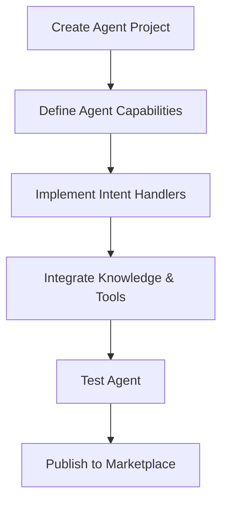

This guide walks you through the process of creating a specialized AI agent for the Vibing AI platform.

## Overview

Agents are AI assistants with domain-specific expertise that primarily use natural language interfaces. They integrate with the [Vibing Super Agent](/key-concepts/vibing-super-agent) to provide specialized capabilities within the platform ecosystem.



## Prerequisites

Before you begin developing your agent, ensure you have:

1. Created a developer account on the Vibing AI Developer Portal
2. Installed the Vibing AI SDK and CLI tools
3. Familiarized yourself with the [key concepts](/key-concepts/vibing-super-agent)

## Project Initialization

Start by creating a new agent project using the Vibing AI CLI:

```bash
# Install the CLI if you haven't already
npm install -g @vibing-ai/cli

# Create a new agent project
vibe init agent my-domain-expert

# Navigate to the project directory
cd my-domain-expert
```

This creates a project with the following structure:

```
my-domain-expert/
├── src/
│   ├── index.ts          # Main entry point
│   ├── intents/          # Intent handlers
│   ├── knowledge/        # Domain knowledge
│   ├── tools/            # Agent-specific tools
│   └── utils/            # Utility functions
├── tests/                # Test files
├── vibe.config.js        # Vibing AI configuration
├── package.json          # Dependencies and scripts
└── README.md             # Project documentation
```

## Agent Configuration

The main configuration for your agent is in `vibe.config.js`:

```javascript
module.exports = {
  name: 'Domain Expert',
  description: 'Expert assistant for specialized domain knowledge',
  version: '1.0.0',
  author: 'Your Name',
  license: 'MIT',
  repository: 'https://github.com/yourusername/my-domain-expert',
  capabilities: [
    'domainExpertise',
    'dataAnalysis',
    'recommendation'
  ],
  intents: [
    'analyze_domain_topic',
    'explain_domain_concept',
    'recommend_resources'
  ],
  surfaces: ['conversationCard'], // Optional UI
  permissions: [
    'memory:read:conversation;purpose=context_analysis;ttl=session',
    'tools:use:web_search;purpose=information_retrieval;ttl=request',
    'memory:write:private;purpose=store_user_preferences;ttl=persistent'
  ],
  settings: {
    // Default agent settings
    responseStyle: 'conversational',
    detailLevel: 'intermediate',
    includeReferences: true
  }
};
```

## Core Agent Development

### Main Agent Implementation

The main agent implementation is in `src/index.ts`:

```typescript
import { createAgent } from '@vibing-ai/sdk/agent';
import { memory } from '@vibing-ai/sdk/memory';
import * as intents from './intents';
import * as tools from './tools';
import { analyzeUserQuery, formatResponse } from './utils';

// Create the agent
const domainExpert = createAgent({
  // Configuration from vibe.config.js is automatically included
  
  // Intent handlers
  handles: {
    'analyze_domain_topic': intents.analyzeDomainTopic,
    'explain_domain_concept': intents.explainDomainConcept,
    'recommend_resources': intents.recommendResources
  },
  
  // Agent-specific tools
  tools: {
    'domain_knowledge_search': tools.domainKnowledgeSearch,
    'concept_graph_lookup': tools.conceptGraphLookup,
    'reference_finder': tools.referenceFinder
  },
  
  // General message handler for natural language input
  onMessage: async (message, context) => {
    // Analyze the message to understand user's query
    const { intent, parameters } = await analyzeUserQuery(message.text);
    
    // Get agent settings (use defaults if not set)
    const settings = await memory.get('private:agent-settings') || {
      responseStyle: 'conversational',
      detailLevel: 'intermediate',
      includeReferences: true
    };
    
    let response;
    
    // Handle the intent if recognized
    if (intent && this.handles[intent]) {
      response = await this.handles[intent](parameters, context);
    } else {
      // Default handling for unrecognized intents
      response = await handleGeneralQuery(message.text, context);
    }
    
    // Format the response according to settings
    return formatResponse(response, settings);
  },
  
  // Handle explicit invocation from Vibing Super Agent
  onInvoke: async (request, context) => {
    const { intent, parameters } = request;
    
    // Verify this agent can handle the requested intent
    if (!this.handles[intent]) {
      return {
        success: false,
        error: `Intent "${intent}" not supported by this agent`
      };
    }
    
    // Process the request
    try {
      const result = await this.handles[intent](parameters, context);
      return {
        success: true,
        data: result
      };
    } catch (error) {
      return {
        success: false,
        error: error.message
      };
    }
  },
  
  // Lifecycle hooks
  onInstall: async () => {
    // Initialize agent data and settings
    await memory.set('private:agent-settings', {
      responseStyle: 'conversational',
      detailLevel: 'intermediate',
      includeReferences: true
    });
    console.log('Agent installed successfully');
  },
  
  onUninstall: async () => {
    // Clean up agent data
    await memory.delete('private:agent-settings');
    console.log('Agent uninstalled successfully');
  }
});

// Helper function for general queries
async function handleGeneralQuery(query, context) {
  // Implement general query handling
  // This might use LLM capabilities, knowledge base, etc.
  return {
    text: `I'll help you with: "${query}"`,
    references: []
  };
}

// Export the agent
export default domainExpert;
```

### Implementing Intent Handlers

Create specialized handlers for each intent your agent supports. Place these in the `src/intents` directory:

#### Domain Topic Analysis (`src/intents/analyzeDomainTopic.ts`)

```typescript
import { tools } from '@vibing-ai/sdk/agent';
import { memory } from '@vibing-ai/sdk/memory';
import { domainKnowledgeSearch } from '../tools';

/**
 * Analyzes a topic within the agent's domain of expertise
 */
export async function analyzeDomainTopic(parameters, context) {
  // Validate parameters
  if (!parameters.topic) {
    throw new Error('Topic parameter is required');
  }
  
  // Log the request for improvement purposes
  await logRequest('analyze_domain_topic', parameters);
  
  // Retrieve domain knowledge about the topic
  const knowledgeResults = await domainKnowledgeSearch(parameters.topic);
  
  // Use web search for supplementary information if needed
  let webResults = [];
  if (knowledgeResults.confidence < 0.8) {
    // Request permission to use web search if not already granted
    const canUseWebSearch = await tools.checkPermission('web_search');
    
    if (canUseWebSearch) {
      webResults = await tools.webSearch(`${parameters.topic} domain knowledge`);
    }
  }
  
  // Combine and analyze the information
  const analysis = await analyzeInformation(parameters.topic, knowledgeResults.data, webResults);
  
  // Structure the response
  return {
    topic: parameters.topic,
    summary: analysis.summary,
    keyPoints: analysis.keyPoints,
    implications: analysis.implications,
    confidence: knowledgeResults.confidence,
    references: [
      ...knowledgeResults.sources,
      ...webResults.map(result => ({ title: result.title, url: result.url }))
    ]
  };
}

// Helper function to log requests for improving the agent
async function logRequest(intent, parameters) {
  const requests = await memory.get('private:request-history') || [];
  requests.push({
    intent,
    parameters,
    timestamp: new Date().toISOString()
  });
  
  // Keep only the last 100 requests
  if (requests.length > 100) {
    requests.shift();
  }
  
  await memory.set('private:request-history', requests);
}

// Helper function to analyze information
async function analyzeInformation(topic, knowledgeData, webResults) {
  // Implement analysis logic here
  // This could use LLM capabilities, structured analysis, etc.
  
  return {
    summary: `${topic} is a key concept in this domain...`,
    keyPoints: [
      'First important point about the topic',
      'Second important point about the topic',
      'Third important point about the topic'
    ],
    implications: 'The implications of this topic include...'
  };
}
```

#### Concept Explanation (`src/intents/explainDomainConcept.ts`)

```typescript
import { memory } from '@vibing-ai/sdk/memory';
import { conceptGraphLookup } from '../tools';

/**
 * Explains a concept within the agent's domain of expertise
 */
export async function explainDomainConcept(parameters, context) {
  // Validate parameters
  if (!parameters.concept) {
    throw new Error('Concept parameter is required');
  }
  
  // Get user preferences for explanation style
  const userPrefs = await memory.get('private:user-preferences') || {};
  const detailLevel = parameters.detailLevel || userPrefs.detailLevel || 'intermediate';
  
  // Look up the concept in the knowledge graph
  const conceptInfo = await conceptGraphLookup(parameters.concept);
  
  if (!conceptInfo.found) {
    return {
      success: false,
      error: `I don't have information about "${parameters.concept}" in my knowledge base.`,
      alternatives: conceptInfo.similar || []
    };
  }
  
  // Adjust explanation based on detail level
  let explanation;
  if (detailLevel === 'beginner') {
    explanation = conceptInfo.simplifiedExplanation || conceptInfo.explanation;
  } else if (detailLevel === 'advanced') {
    explanation = conceptInfo.detailedExplanation || conceptInfo.explanation;
  } else {
    explanation = conceptInfo.explanation;
  }
  
  // Include related concepts
  const relatedConcepts = conceptInfo.relatedConcepts || [];
  
  // Structure the response
  return {
    concept: parameters.concept,
    explanation: explanation,
    examples: conceptInfo.examples || [],
    relatedConcepts: relatedConcepts.map(rc => ({
      name: rc.name,
      relationship: rc.relationshipType
    })),
    references: conceptInfo.references || []
  };
}
```

#### Resource Recommendations (`src/intents/recommendResources.ts`)

```typescript
import { memory } from '@vibing-ai/sdk/memory';
import { referenceFinder } from '../tools';

/**
 * Recommends resources related to a domain topic
 */
export async function recommendResources(parameters, context) {
  // Validate parameters
  if (!parameters.topic) {
    throw new Error('Topic parameter is required');
  }
  
  // Get user history to improve recommendations
  const userHistory = await memory.get('private:user-history') || { topics: [] };
  
  // Add current topic to history
  userHistory.topics.push({
    name: parameters.topic,
    timestamp: new Date().toISOString()
  });
  
  // Keep history manageable
  if (userHistory.topics.length > 50) {
    userHistory.topics = userHistory.topics.slice(-50);
  }
  
  await memory.set('private:user-history', userHistory);
  
  // Get resource type preference
  const resourceType = parameters.resourceType || 'all';
  
  // Find relevant resources
  const resources = await referenceFinder(parameters.topic, {
    type: resourceType,
    level: parameters.level || 'all',
    limit: parameters.limit || 5
  });
  
  // Structure the response
  return {
    topic: parameters.topic,
    recommendations: resources.map(resource => ({
      title: resource.title,
      description: resource.description,
      type: resource.type,
      url: resource.url,
      relevanceScore: resource.score
    })),
    additionalSuggestions: `For more resources on ${parameters.topic}, you might also explore related topics like ${resources.relatedTopics.join(', ')}.`
  };
}
```

### Implementing Agent-Specific Tools

Create specialized tools that your agent can use. Place these in the `src/tools` directory:

#### Domain Knowledge Search (`src/tools/domainKnowledgeSearch.ts`)

```typescript
/**
 * Searches the agent's specialized knowledge base
 */
export async function domainKnowledgeSearch(query, options = {}) {
  // Default options
  const searchOptions = {
    limit: options.limit || 10,
    threshold: options.threshold || 0.7,
    includeMetadata: options.includeMetadata !== false
  };
  
  // Implementation would connect to your knowledge base
  // This could be a vector database, API call, etc.
  
  // Simulated results for demonstration
  const results = [
    {
      content: 'Detailed information about the topic...',
      score: 0.92,
      metadata: {
        source: 'Domain Knowledge Base',
        lastUpdated: '2023-05-15'
      }
    },
    {
      content: 'Additional perspective on the topic...',
      score: 0.85,
      metadata: {
        source: 'Expert Interviews',
        lastUpdated: '2023-04-22'
      }
    }
  ];
  
  // Calculate overall confidence
  const confidence = results.length > 0
    ? results.reduce((sum, r) => sum + r.score, 0) / results.length
    : 0;
  
  // Format sources
  const sources = results.map(r => ({
    title: r.metadata?.source || 'Knowledge Base',
    date: r.metadata?.lastUpdated
  }));
  
  return {
    data: results.map(r => r.content),
    confidence,
    sources
  };
}
```

#### Concept Graph Lookup (`src/tools/conceptGraphLookup.ts`)

```typescript
/**
 * Looks up concepts in a knowledge graph
 */
export async function conceptGraphLookup(concept) {
  // Implementation would connect to your concept graph
  // This could be a graph database, structured knowledge base, etc.
  
  // Simulated response for demonstration
  if (concept.toLowerCase() === 'example concept') {
    return {
      found: true,
      concept: 'Example Concept',
      explanation: 'This is an explanation of the example concept.',
      simplifiedExplanation: 'Simple version for beginners.',
      detailedExplanation: 'Detailed technical explanation for advanced users.',
      examples: [
        'Example 1 of the concept in action',
        'Example 2 of the concept in action'
      ],
      relatedConcepts: [
        { name: 'Related Concept A', relationshipType: 'prerequisite' },
        { name: 'Related Concept B', relationshipType: 'similar' }
      ],
      references: [
        { title: 'Comprehensive Guide', url: 'https://example.com/guide' }
      ]
    };
  }
  
  // Concept not found
  return {
    found: false,
    similar: ['Similar Concept 1', 'Similar Concept 2']
  };
}
```

#### Reference Finder (`src/tools/referenceFinder.ts`)

```typescript
/**
 * Finds relevant references for a topic
 */
export async function referenceFinder(topic, options = {}) {
  // Default options
  const searchOptions = {
    type: options.type || 'all',
    level: options.level || 'all',
    limit: options.limit || 5
  };
  
  // Implementation would search your reference database
  // This could be a curated collection, API, etc.
  
  // Simulated results for demonstration
  const results = [
    {
      title: 'Comprehensive Guide to the Topic',
      description: 'An in-depth exploration of all aspects of the topic.',
      type: 'article',
      url: 'https://example.com/guide',
      score: 0.95
    },
    {
      title: 'Video Tutorial Series',
      description: 'Step-by-step video explanations of the topic.',
      type: 'video',
      url: 'https://example.com/tutorials',
      score: 0.88
    },
    {
      title: 'Interactive Learning Tool',
      description: 'Hands-on learning environment for the topic.',
      type: 'interactive',
      url: 'https://example.com/interactive',
      score: 0.82
    }
  ];
  
  // Filter by type if specified
  const filteredResults = searchOptions.type === 'all'
    ? results
    : results.filter(r => r.type === searchOptions.type);
  
  // Return results with related topics
  return {
    ...filteredResults,
    relatedTopics: ['Related Topic A', 'Related Topic B', 'Related Topic C']
  };
}
```

### Utility Functions

Create helper utilities for your agent in the `src/utils` directory:

#### Query Analysis (`src/utils/analyzeUserQuery.ts`)

```typescript
/**
 * Analyzes a user query to determine intent and extract parameters
 */
export async function analyzeUserQuery(text) {
  // Implementation would use NLU capabilities
  // This could leverage LLMs, rule-based systems, etc.
  
  // Simple pattern matching for demonstration
  if (text.match(/analyze|examination|overview of/i)) {
    // Extract topic from query
    const topicMatch = text.match(/(?:of|about|on) ([^?.,]+)/i);
    const topic = topicMatch ? topicMatch[1].trim() : '';
    
    return {
      intent: 'analyze_domain_topic',
      parameters: { topic }
    };
  }
  
  if (text.match(/explain|what is|definition of|mean/i)) {
    // Extract concept from query
    const conceptMatch = text.match(/(?:is|of|mean by) ([^?.,]+)/i);
    const concept = conceptMatch ? conceptMatch[1].trim() : '';
    
    return {
      intent: 'explain_domain_concept',
      parameters: { concept }
    };
  }
  
  if (text.match(/recommend|suggest|resources|materials|reading/i)) {
    // Extract topic from query
    const topicMatch = text.match(/(?:on|about|for) ([^?.,]+)/i);
    const topic = topicMatch ? topicMatch[1].trim() : '';
    
    return {
      intent: 'recommend_resources',
      parameters: { topic }
    };
  }
  
  // No clear intent detected
  return {
    intent: null,
    parameters: { query: text }
  };
}
```

#### Response Formatting (`src/utils/formatResponse.ts`)

```typescript
/**
 * Formats agent responses according to settings
 */
export function formatResponse(response, settings) {
  // Apply response style formatting
  let formattedResponse = applyResponseStyle(response, settings.responseStyle);
  
  // Adjust detail level
  formattedResponse = adjustDetailLevel(formattedResponse, settings.detailLevel);
  
  // Include or exclude references
  if (!settings.includeReferences) {
    delete formattedResponse.references;
  }
  
  return formattedResponse;
}

// Helper function to apply response style
function applyResponseStyle(response, style) {
  const result = { ...response };
  
  switch (style) {
    case 'conversational':
      // Make the response more conversational
      if (result.text) {
        result.text = addConversationalElements(result.text);
      }
      break;
    case 'concise':
      // Make the response more concise
      if (result.text) {
        result.text = makeConcise(result.text);
      }
      break;
    case 'technical':
      // Use more technical language
      if (result.text) {
        result.text = addTechnicalElements(result.text);
      }
      break;
    // Add more styles as needed
  }
  
  return result;
}

// Helper function to adjust detail level
function adjustDetailLevel(response, level) {
  const result = { ...response };
  
  switch (level) {
    case 'beginner':
      // Simplify explanations
      // Remove advanced details
      break;
    case 'intermediate':
      // Balanced approach
      break;
    case 'advanced':
      // Include more technical details
      // Add deeper insights
      break;
  }
  
  return result;
}

// Helper functions for text transformation
function addConversationalElements(text) {
  // Add conversational markers
  return text;
}

function makeConcise(text) {
  // Remove unnecessary words, focus on key points
  return text;
}

function addTechnicalElements(text) {
  // Add technical terminology and precision
  return text;
}
```

## Testing Your Agent

Test your agent using the built-in testing utilities:

```bash
# Run tests
vibe test

# Test specific intents
vibe test --intents analyze_domain_topic,explain_domain_concept

# Test with coverage
vibe test --coverage
```

Create test files in the `tests` directory:

```typescript
// tests/intents.test.ts
import { simulateAgent, simulateMemory } from '@vibing-ai/sdk/testing';
import { analyzeDomainTopic } from '../src/intents/analyzeDomainTopic';

describe('Domain Topic Analysis Intent', () => {
  beforeEach(() => {
    // Set up memory simulation
    simulateMemory({
      'private:user-preferences': { detailLevel: 'intermediate' }
    });
  });
  
  test('analyzes topic correctly', async () => {
    const parameters = { topic: 'example topic' };
    const context = {};
    
    const result = await analyzeDomainTopic(parameters, context);
    
    expect(result.topic).toBe('example topic');
    expect(result.summary).toBeDefined();
    expect(result.keyPoints.length).toBeGreaterThan(0);
    expect(result.references).toBeDefined();
  });
  
  test('fails when topic is missing', async () => {
    const parameters = {};
    const context = {};
    
    await expect(analyzeDomainTopic(parameters, context))
      .rejects.toThrow('Topic parameter is required');
  });
});

// tests/agent.test.ts
import { simulateConversation } from '@vibing-ai/sdk/testing';
import domainExpert from '../src/index';

describe('Domain Expert Agent', () => {
  test('responds to topic analysis request', async () => {
    const conversation = simulateConversation(domainExpert);
    
    const response = await conversation.send('Can you analyze the topic of knowledge graphs?');
    
    expect(response.text).toContain('knowledge graphs');
    expect(response.keyPoints).toBeDefined();
  });
  
  test('explains concepts when asked', async () => {
    const conversation = simulateConversation(domainExpert);
    
    const response = await conversation.send('Can you explain what a neural network is?');
    
    expect(response.concept).toBe('neural network');
    expect(response.explanation).toBeDefined();
  });
});
```

## Integration with Vibing Super Agent

Agents are typically invoked by the Vibing Super Agent. Here's how the integration works:

```typescript
// This happens in the platform - you don't need to implement it
// It's shown here for understanding the flow

// The Vibing Super Agent receives a user message
const userMessage = "I need an expert analysis of quantum computing";

// The Super Agent determines intent and appropriate specialized agent
const intentAnalysis = {
  domain: "quantum computing",
  action: "expert analysis",
  bestAgent: "domain-expert-agent-id"
};

// The Super Agent invokes your specialized agent
const agentResponse = await invokeDomainExpert(
  "analyze_domain_topic",
  { topic: "quantum computing" },
  { conversation: currentConversation }
);

// The Super Agent incorporates your agent's response
const finalResponse = formatSuperAgentResponse(agentResponse);

// The response is sent back to the user
sendResponseToUser(finalResponse);
```

## Knowledge Integration

Effective agents require domain knowledge. There are several approaches to integrating knowledge:

### Embedded Knowledge

```typescript
// src/knowledge/domainConcepts.ts
export const domainConcepts = {
  "concept1": {
    definition: "Definition of concept 1",
    examples: ["Example 1", "Example 2"],
    relatedConcepts: ["concept2", "concept3"]
  },
  "concept2": {
    definition: "Definition of concept 2",
    examples: ["Example 1", "Example 2"],
    relatedConcepts: ["concept1", "concept4"]
  },
  // ... more concepts
};
```

### External Knowledge Bases

```typescript
// src/tools/knowledgeBase.ts
import { Pinecone } from '@vibing-ai/sdk/integrations/pinecone';

// Initialize vector database
const pinecone = new Pinecone({
  apiKey: process.env.PINECONE_API_KEY,
  environment: process.env.PINECONE_ENVIRONMENT,
  index: 'domain-expert-knowledge'
});

/**
 * Search the knowledge base
 */
export async function searchKnowledgeBase(query, options = {}) {
  // Generate embedding for the query
  const embedding = await generateEmbedding(query);
  
  // Search the vector database
  const results = await pinecone.query({
    vector: embedding,
    topK: options.limit || 5,
    includeMetadata: true
  });
  
  return results.matches.map(match => ({
    content: match.metadata.content,
    source: match.metadata.source,
    url: match.metadata.url,
    score: match.score
  }));
}
```

### Retrieval Augmentation

```typescript
// src/utils/retrievalAugmentation.ts
import { searchKnowledgeBase } from '../tools/knowledgeBase';

/**
 * Augment agent responses with retrieved knowledge
 */
export async function augmentWithKnowledge(query, baseResponse) {
  // Retrieve relevant knowledge
  const knowledgeResults = await searchKnowledgeBase(query);
  
  // Enhance the response with retrieved information
  const augmentedResponse = {
    ...baseResponse,
    augmentedWith: knowledgeResults.map(r => r.source),
    confidence: calculateConfidence(baseResponse, knowledgeResults)
  };
  
  // Integrate retrieved knowledge into the response
  if (knowledgeResults.length > 0) {
    augmentedResponse.text = enhanceTextWithKnowledge(
      baseResponse.text,
      knowledgeResults
    );
  }
  
  return augmentedResponse;
}
```

## Deployment & Publication

When ready to publish your agent:

```bash
# Validate your agent
vibe validate

# Build for production
vibe build

# Submit to the marketplace
vibe submit
```

## Best Practices

### Creating Effective Agents

- **Focus on a specific domain** - Narrow agents are more effective than broad ones
- **Define clear capabilities** - Help the Super Agent understand when to invoke your agent
- **Implement robust intent recognition** - Accurately determine what users are asking for
- **Provide detailed responses** - Include explanations, examples, and references
- **Build in flexibility** - Support different user preferences and knowledge levels

### Knowledge Management

- **Keep knowledge up to date** - Regularly refresh your agent's knowledge base
- **Cite sources** - Always provide references for information
- **Handle uncertainty gracefully** - Be clear when confidence is low
- **Suggest alternatives** - Provide related information when exact matches aren't found

### User Experience

- **Maintain conversation context** - Remember previous interactions
- **Adapt to user needs** - Adjust responses based on user preferences
- **Explain technical concepts clearly** - Make complex information accessible
- **Highlight key information** - Structure responses for easy comprehension

### Security & Privacy

- **Respect permission boundaries** - Only access data you have permission for
- **Protect user information** - Don't expose sensitive data
- **Follow platform guidelines** - Adhere to content policies
- **Provide transparency** - Be clear about capabilities and limitations

## Troubleshooting

### Common Issues

**Issue**: Agent isn't being invoked by the Super Agent.
**Solution**: Ensure your agent's capabilities and intents are clearly defined in `vibe.config.js`.

**Issue**: Intent recognition fails for valid queries.
**Solution**: Expand your query analysis logic and test with a variety of phrasings.

**Issue**: Knowledge retrieval returns irrelevant results.
**Solution**: Refine your search implementation and improve knowledge organization.

## Related Resources

- [Vibing Super Agent](/key-concepts/vibing-super-agent)
- [Permission Model](/key-concepts/permission-model)
- [Unified Memory System](/key-concepts/unified-memory-system)
- [Conversation Context Guide](/developer-guides/conversation-context)

## Next Steps

- [Learn about App Development](/developer-guides/app-development)
- [Explore Plugin Development](/developer-guides/plugin-development)
- [Understand Interface Surfaces](/key-concepts/interface-surfaces) 