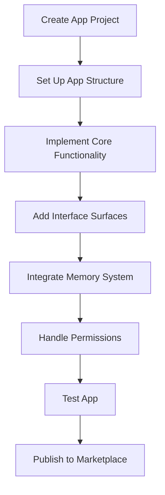

# App Development

This guide walks you through the process of creating a fully-featured app for the Vibing AI platform.

## Overview

Apps are comprehensive offerings that provide rich user interfaces and extensive functionality. They can implement multiple interface surfaces and deeply integrate with the platform's capabilities.



## Prerequisites

Before you begin developing your app, ensure you have:

1. Created a developer account on the Vibing AI Developer Portal
2. Installed the Vibing AI SDK and CLI tools
3. Familiarized yourself with the [key concepts](/key-concepts/vibing-super-agent)

## Project Initialization

Start by creating a new app project using the Vibing AI CLI:

```bash
# Install the CLI if you haven't already
npm install -g @vibing-ai/cli

# Create a new app project
vibe init app my-awesome-app

# Navigate to the project directory
cd my-awesome-app
```

This creates a project with the following structure:

```
my-awesome-app/
├── src/
│   ├── index.ts          # Main entry point
│   ├── components/       # UI components
│   ├── services/         # Business logic and services
│   └── assets/           # Images, fonts, and other assets
├── public/               # Static assets
├── tests/                # Test files
├── vibe.config.js        # Vibing AI configuration
├── package.json          # Dependencies and scripts
└── README.md             # Project documentation
```

## App Configuration

The main configuration for your app is in `vibe.config.js`:

```javascript
module.exports = {
  name: 'My Awesome App',
  description: 'A powerful and intuitive application for Vibing AI',
  version: '1.0.0',
  author: 'Your Name',
  license: 'MIT',
  repository: 'https://github.com/yourusername/my-awesome-app',
  surfaces: ['conversationCard', 'appTab', 'sidebarPanel'],
  permissions: [
    'memory:read:project;purpose=user_context;ttl=session',
    'memory:write:project;purpose=save_user_data;ttl=persistent'
  ],
  dependencies: {
    // Other offerings your app depends on
  },
  settings: {
    // Default app settings
  }
};
```

## Core App Development

### Main App Implementation

The main app implementation is in `src/index.ts`:

```typescript
import { createApp } from '@vibing-ai/sdk/app';
import { memory } from '@vibing-ai/sdk/memory';
import { renderAppTab } from './surfaces/appTab';
import { renderConversationCard } from './surfaces/conversationCard';
import { renderSidebarPanel } from './surfaces/sidebarPanel';

// Create the app
const myAwesomeApp = createApp({
  // Configuration from vibe.config.js is automatically included
  
  // Render function handles all surfaces
  onRender: (container, context) => {
    const { surface } = context;
    
    // Render different UI based on the surface
    if (surface === 'appTab') {
      renderAppTab(container, context);
    } else if (surface === 'conversationCard') {
      renderConversationCard(container, context);
    } else if (surface === 'sidebarPanel') {
      renderSidebarPanel(container, context);
    }
  },
  
  // Lifecycle hooks
  onInstall: async () => {
    // Initialize app data and settings
    await memory.set('private:app-settings', { theme: 'light' });
    console.log('App installed successfully');
  },
  
  onUninstall: async () => {
    // Clean up app data
    await memory.delete('private:app-settings');
    console.log('App uninstalled successfully');
  },
  
  onUpdate: async (prevVersion) => {
    // Handle version updates
    console.log(`App updated from ${prevVersion}`);
  }
});

// Export the app
export default myAwesomeApp;
```

### Implementing Surface-Specific UI

Create separate modules for each interface surface:

#### App Tab (`src/surfaces/appTab.ts`)

```typescript
import { Card, Text, Button } from '@vibing-ai/block-kit';
import { memory } from '@vibing-ai/sdk/memory';

export function renderAppTab(container, context) {
  // Get user data from memory
  memory.get('project:user-data').then(userData => {
    // Create main app layout
    const appLayout = document.createElement('div');
    appLayout.className = 'app-layout';
    
    // Create header
    const header = document.createElement('header');
    header.innerHTML = `<h1>My Awesome App</h1>`;
    
    // Create main content area
    const content = document.createElement('main');
    
    // Create content using Block Kit
    const card = new Card({
      title: 'Welcome',
      content: [
        new Text(`Hello, ${userData?.name || 'User'}!`),
        new Button('Get Started', {
          onClick: () => {
            // Handle button click
          }
        })
      ]
    });
    
    // Render card in content area
    card.render(content);
    
    // Append all elements
    appLayout.appendChild(header);
    appLayout.appendChild(content);
    container.appendChild(appLayout);
  });
}
```

#### Conversation Card (`src/surfaces/conversationCard.ts`)

```typescript
import { Card, Text, Input, Button } from '@vibing-ai/block-kit';

export function renderConversationCard(container, context) {
  // Create a conversation card
  const card = new Card({
    title: 'Quick Action',
    content: [
      new Text('What would you like to do?'),
      new Input({
        type: 'text',
        placeholder: 'Enter your task',
        id: 'task-input'
      }),
      new Button('Submit', {
        onClick: (event, elements) => {
          const taskInput = elements.getElementById('task-input');
          const task = taskInput.value;
          
          // Process the task
          console.log('Processing task:', task);
          
          // Show confirmation
          elements.replaceWith(
            new Text(`Task "${task}" has been added!`)
          );
        }
      })
    ]
  });
  
  // Render card in container
  card.render(container);
}
```

#### Sidebar Panel (`src/surfaces/sidebarPanel.ts`)

```typescript
import { Stack, Text, Link, Divider } from '@vibing-ai/block-kit/layout';

export function renderSidebarPanel(container, context) {
  // Create a sidebar panel
  const sidebar = new Stack({
    direction: 'vertical',
    spacing: 'medium',
    children: [
      new Text('Resources', { variant: 'heading' }),
      new Divider(),
      new Link('Documentation', { href: '#', target: '_blank' }),
      new Link('Examples', { href: '#', target: '_blank' }),
      new Link('Community', { href: '#', target: '_blank' })
    ]
  });
  
  // Render sidebar in container
  sidebar.render(container);
}
```

## Working with Memory

Apps often need to store and retrieve data. Use the Unified Memory System for this purpose:

```typescript
import { memory } from '@vibing-ai/sdk/memory';

// Store data
async function saveUserPreferences(preferences) {
  await memory.set('private:user-preferences', preferences);
}

// Retrieve data
async function getUserPreferences() {
  return await memory.get('private:user-preferences');
}

// Update data
async function updateUserPreference(key, value) {
  const preferences = await getUserPreferences() || {};
  preferences[key] = value;
  await saveUserPreferences(preferences);
}

// Delete data
async function resetUserPreferences() {
  await memory.delete('private:user-preferences');
}
```

## Handling Permissions

If your app requires additional permissions at runtime:

```typescript
import { permissions } from '@vibing-ai/sdk/permissions';

async function requestMicrophoneAccess() {
  const granted = await permissions.request([
    'sensors:access:microphone;purpose=voice_recording;ttl=15m'
  ]);
  
  if (granted) {
    // Proceed with microphone access
    startRecording();
  } else {
    // Handle permission denied
    showPermissionDeniedMessage();
  }
}
```

## Event System Integration

Connect your app with the platform's event system:

```typescript
import { events } from '@vibing-ai/sdk/events';

// Subscribe to platform events
events.on('user:login', (userData) => {
  console.log('User logged in:', userData);
  refreshUserInterface();
});

// Emit custom events
function notifyTaskCompleted(taskId) {
  events.emit('my-app:task-completed', { 
    taskId, 
    completedAt: new Date().toISOString() 
  });
}

// Subscribe to your own events
events.on('my-app:task-completed', (data) => {
  showNotification(`Task ${data.taskId} completed!`);
});
```

## Testing Your App

Test your app using the built-in testing utilities:

```bash
# Run tests
vibe test

# Test with specific surface
vibe test --surface appTab

# Test with coverage
vibe test --coverage
```

Create test files in the `tests` directory:

```typescript
// tests/app.test.ts
import { simulateUser, simulateMemory } from '@vibing-ai/sdk/testing';
import myAwesomeApp from '../src/index';

describe('My Awesome App', () => {
  test('renders correctly on app tab', async () => {
    // Simulate memory data
    simulateMemory({
      'project:user-data': { name: 'Test User' }
    });
    
    // Simulate user interaction
    const user = simulateUser(myAwesomeApp, { surface: 'appTab' });
    
    // Verify rendering
    expect(user.see('Welcome')).toBe(true);
    expect(user.see('Hello, Test User!')).toBe(true);
    
    // Test interaction
    await user.click('button:contains("Get Started")');
    expect(user.see('Getting started guide')).toBe(true);
  });
});
```

## Debugging Your App

Run your app in development mode for hot-reloading and debugging:

```bash
# Start development server
vibe dev

# Run in debug mode
vibe dev --debug
```

Access debugging tools:

1. Open your app in the development environment
2. Use the browser's developer tools (F12 or Cmd+Option+I)
3. Check the "Vibing" tab for platform-specific debugging
4. View logs, memory state, and permission status

## Deployment & Publication

When ready to publish your app:

```bash
# Validate your app
vibe validate

# Build for production
vibe build

# Preview the production build
vibe preview

# Submit to the marketplace
vibe submit
```

## Best Practices

### Performance

- Lazy-load resources and components
- Optimize memory usage with appropriate TTLs
- Use efficient rendering patterns
- Cache results for expensive operations

### User Experience

- Follow the Vibing AI design guidelines
- Ensure accessibility compliance
- Support responsive layouts
- Provide clear feedback for user actions
- Implement progressive enhancement

### Security

- Request minimal permissions
- Never store sensitive data in unprotected memory
- Validate all user inputs
- Implement secure authentication for external services
- Follow the principle of least privilege

## Troubleshooting

### Common Issues

**Issue**: App fails to render on a specific surface.
**Solution**: Check that the surface is properly registered in `vibe.config.js` and that your render function handles that surface.

**Issue**: Permission errors when accessing memory.
**Solution**: Verify your app has requested the necessary permissions with appropriate purpose statements and TTLs.

**Issue**: Block Kit components not displaying correctly.
**Solution**: Ensure you're using the latest version of Block Kit and check the component documentation for proper usage.

## Related Resources

- [Interface Surfaces](/key-concepts/interface-surfaces)
- [Permission Model](/key-concepts/permission-model)
- [Block Kit Library Documentation](/developer-guides/block-kit)
- [Unified Memory System](/key-concepts/unified-memory-system)

## Next Steps

- [Learn about Plugin Development](/developer-guides/plugin-development)
- [Explore Agent Development](/developer-guides/agent-development)
- [Understand Vibing Super Agent](/key-concepts/vibing-super-agent) 