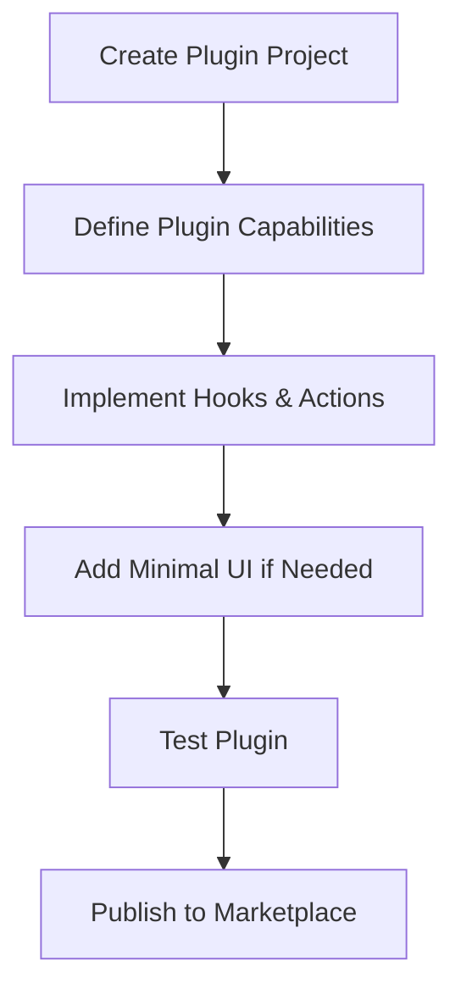

This guide walks you through the process of creating a plugin for the Vibing AI platform.

## Overview

Plugins are specialized extensions that enhance platform functionality, often with minimal UI. They focus on specific capabilities rather than standalone experiences and can integrate tightly with the core platform and other offerings.



## Prerequisites

Before you begin developing your plugin, ensure you have:

1. Created a developer account on the Vibing AI Developer Portal
2. Installed the Vibing AI SDK and CLI tools
3. Familiarized yourself with the [key concepts](/key-concepts/vibing-super-agent)

## Project Initialization

Start by creating a new plugin project using the Vibing AI CLI:

```bash
# Install the CLI if you haven't already
npm install -g @vibing-ai/cli

# Create a new plugin project
vibe init plugin my-productivity-plugin

# Navigate to the project directory
cd my-productivity-plugin
```

This creates a project with the following structure:

```
my-productivity-plugin/
├── src/
│   ├── index.ts          # Main entry point
│   ├── hooks/            # Plugin hooks
│   ├── actions/          # Plugin actions
│   └── ui/               # Optional UI components
├── tests/                # Test files
├── vibe.config.js        # Vibing AI configuration
├── package.json          # Dependencies and scripts
└── README.md             # Project documentation
```

## Plugin Configuration

The main configuration for your plugin is in `vibe.config.js`:

```javascript
module.exports = {
  name: 'My Productivity Plugin',
  description: 'Enhance productivity with smart features',
  version: '1.0.0',
  author: 'Your Name',
  license: 'MIT',
  repository: 'https://github.com/yourusername/my-productivity-plugin',
  surfaces: ['conversationCard'], // Optional UI surfaces
  permissions: [
    'memory:read:conversation;purpose=analyze_context;ttl=session',
    'memory:write:private;purpose=store_preferences;ttl=persistent'
  ],
  hooks: [
    'message:pre-send',
    'memory:post-write',
    'conversation:start'
  ],
  actions: [
    'createTask',
    'completeTask',
    'scheduleReminder'
  ],
  dependencies: {
    // Other offerings your plugin depends on
  }
};
```

## Core Plugin Development

### Main Plugin Implementation

The main plugin implementation is in `src/index.ts`:

```typescript
import { createPlugin } from '@vibing-ai/sdk/plugin';
import { memory } from '@vibing-ai/sdk/memory';
import * as hooks from './hooks';
import * as actions from './actions';
import { renderUI } from './ui';

// Create the plugin
const myProductivityPlugin = createPlugin({
  // Configuration from vibe.config.js is automatically included
  
  // Hooks for platform integration
  hooks: {
    'message:pre-send': hooks.processOutgoingMessage,
    'memory:post-write': hooks.handleMemoryUpdate,
    'conversation:start': hooks.initializeConversation
  },
  
  // Actions that can be invoked by other offerings
  actions: {
    createTask: actions.createTask,
    completeTask: actions.completeTask,
    scheduleReminder: actions.scheduleReminder
  },
  
  // Optional UI rendering for supported surfaces
  onRender: (container, context) => {
    renderUI(container, context);
  },
  
  // Lifecycle hooks
  onInstall: async () => {
    // Initialize plugin data and settings
    await memory.set('private:plugin-settings', { enabled: true });
    console.log('Plugin installed successfully');
  },
  
  onUninstall: async () => {
    // Clean up plugin data
    await memory.delete('private:plugin-settings');
    console.log('Plugin uninstalled successfully');
  }
});

// Export the plugin
export default myProductivityPlugin;
```

### Implementing Hooks

Hooks are callback functions that are triggered by specific platform events. Create them in the `src/hooks` directory:

#### Message Pre-Send Hook (`src/hooks/processOutgoingMessage.ts`)

```typescript
import { memory } from '@vibing-ai/sdk/memory';

/**
 * Process outgoing messages before they are sent
 * Can modify, enrich, or validate messages
 */
export async function processOutgoingMessage(message, context) {
  // Get plugin settings
  const settings = await memory.get('private:plugin-settings') || { enabled: true };
  
  // Skip processing if disabled
  if (!settings.enabled) {
    return message;
  }
  
  // Check for task creation commands
  if (message.text.includes('/task ')) {
    // Extract task details
    const taskContent = message.text.replace('/task ', '');
    
    // Store task in memory
    const tasks = await memory.get('private:tasks') || [];
    tasks.push({
      id: generateTaskId(),
      content: taskContent,
      created: new Date().toISOString(),
      completed: false
    });
    await memory.set('private:tasks', tasks);
    
    // Modify the message to confirm
    message.text = message.text.replace('/task ', '');
    message.metadata = {
      ...message.metadata,
      taskCreated: true
    };
  }
  
  return message;
}

// Helper function to generate unique task ID
function generateTaskId() {
  return `task_${Date.now()}_${Math.random().toString(36).substring(2, 9)}`;
}
```

#### Memory Post-Write Hook (`src/hooks/handleMemoryUpdate.ts`)

```typescript
/**
 * React to memory changes
 * Can be used to synchronize data or trigger actions
 */
export async function handleMemoryUpdate(event, context) {
  // Check if relevant memory was updated
  if (event.key === 'private:tasks') {
    // Trigger UI refresh if plugin UI is active
    if (context.surfaceActive) {
      context.refreshUI();
    }
    
    // Perform additional actions based on the update
    const tasks = event.newValue || [];
    const completedTasks = tasks.filter(task => task.completed);
    
    if (completedTasks.length > 0) {
      console.log(`${completedTasks.length} tasks completed`);
      // Could trigger notifications or other actions
    }
  }
}
```

#### Conversation Start Hook (`src/hooks/initializeConversation.ts`)

```typescript
import { memory } from '@vibing-ai/sdk/memory';

/**
 * Called when a new conversation starts
 * Can initialize conversation-specific data
 */
export async function initializeConversation(conversation, context) {
  // Get user preferences
  const userPrefs = await memory.get('global:user-preferences') || {};
  
  // Check if task tracking is enabled for new conversations
  if (userPrefs.enableTaskTracking) {
    // Initialize conversation-specific task list
    await memory.set(`conversation:${conversation.id}:tasks`, []);
    
    // Add initial message to conversation
    return {
      shouldAddMessage: true,
      message: {
        text: "I'll help track tasks in this conversation. Use /task to create new tasks.",
        sender: 'system',
        metadata: {
          isPluginMessage: true,
          pluginId: context.pluginId
        }
      }
    };
  }
  
  // Don't modify the conversation
  return { shouldAddMessage: false };
}
```

### Implementing Actions

Actions are functions that can be invoked by other offerings. Create them in the `src/actions` directory:

#### Create Task Action (`src/actions/createTask.ts`)

```typescript
import { memory } from '@vibing-ai/sdk/memory';

/**
 * Create a new task
 */
export async function createTask(params, context) {
  // Validate parameters
  if (!params.content) {
    throw new Error('Task content is required');
  }
  
  // Get existing tasks
  const tasks = await memory.get('private:tasks') || [];
  
  // Create new task
  const newTask = {
    id: `task_${Date.now()}_${Math.random().toString(36).substring(2, 9)}`,
    content: params.content,
    created: new Date().toISOString(),
    completed: false,
    due: params.dueDate || null,
    tags: params.tags || [],
    metadata: params.metadata || {}
  };
  
  // Add to task list
  tasks.push(newTask);
  await memory.set('private:tasks', tasks);
  
  // Return the created task
  return {
    success: true,
    task: newTask
  };
}
```

#### Complete Task Action (`src/actions/completeTask.ts`)

```typescript
import { memory } from '@vibing-ai/sdk/memory';

/**
 * Mark a task as completed
 */
export async function completeTask(params, context) {
  // Validate parameters
  if (!params.taskId) {
    throw new Error('Task ID is required');
  }
  
  // Get existing tasks
  const tasks = await memory.get('private:tasks') || [];
  
  // Find and update the task
  const taskIndex = tasks.findIndex(task => task.id === params.taskId);
  
  if (taskIndex === -1) {
    return {
      success: false,
      error: 'Task not found'
    };
  }
  
  // Mark as completed
  tasks[taskIndex].completed = true;
  tasks[taskIndex].completedAt = new Date().toISOString();
  
  // Update task list
  await memory.set('private:tasks', tasks);
  
  // Return the updated task
  return {
    success: true,
    task: tasks[taskIndex]
  };
}
```

#### Schedule Reminder Action (`src/actions/scheduleReminder.ts`)

```typescript
import { memory } from '@vibing-ai/sdk/memory';
import { permissions } from '@vibing-ai/sdk/permissions';

/**
 * Schedule a reminder for a task
 */
export async function scheduleReminder(params, context) {
  // Validate parameters
  if (!params.taskId || !params.reminderTime) {
    throw new Error('Task ID and reminder time are required');
  }
  
  // Request notification permission if needed
  const hasPermission = await permissions.check('user:notify:push;purpose=task_reminders');
  
  if (!hasPermission) {
    const granted = await permissions.request([
      'user:notify:push;purpose=task_reminders;ttl=90d'
    ]);
    
    if (!granted) {
      return {
        success: false,
        error: 'Notification permission denied'
      };
    }
  }
  
  // Get existing tasks
  const tasks = await memory.get('private:tasks') || [];
  
  // Find the task
  const taskIndex = tasks.findIndex(task => task.id === params.taskId);
  
  if (taskIndex === -1) {
    return {
      success: false,
      error: 'Task not found'
    };
  }
  
  // Add reminder to task
  tasks[taskIndex].reminder = {
    time: params.reminderTime,
    message: params.message || `Reminder: ${tasks[taskIndex].content}`,
    created: new Date().toISOString()
  };
  
  // Update task list
  await memory.set('private:tasks', tasks);
  
  // Schedule actual reminder
  // (This would integrate with the platform's notification system)
  
  // Return success
  return {
    success: true,
    reminder: tasks[taskIndex].reminder
  };
}
```

### Optional UI Implementation

If your plugin has UI components, create them in the `src/ui` directory:

#### UI Renderer (`src/ui/index.ts`)

```typescript
import { Card, Text, Button, List } from '@vibing-ai/block-kit';
import { memory } from '@vibing-ai/sdk/memory';

/**
 * Render plugin UI when needed
 */
export async function renderUI(container, context) {
  // Currently only supports conversation card surface
  if (context.surface !== 'conversationCard') {
    return;
  }
  
  // Get tasks from memory
  const tasks = await memory.get('private:tasks') || [];
  
  // Get current conversation tasks if applicable
  let conversationTasks = [];
  if (context.conversation?.id) {
    conversationTasks = await memory.get(`conversation:${context.conversation.id}:tasks`) || [];
  }
  
  // Combine and filter tasks
  const allTasks = [...tasks, ...conversationTasks]
    .filter((task, index, self) => 
      index === self.findIndex(t => t.id === task.id)
    )
    .filter(task => !task.completed)
    .sort((a, b) => new Date(a.created) - new Date(b.created));
  
  // Create task list UI
  const card = new Card({
    title: 'Tasks',
    content: [
      allTasks.length === 0 
        ? new Text('No active tasks. Use "/task [description]" to create a new task.')
        : new List({
            items: allTasks.map(task => ({
              key: task.id,
              content: [
                new Text(task.content),
                new Button('Complete', { 
                  onClick: async () => {
                    await completeTaskFromUI(task.id);
                    context.refreshUI();
                  }
                })
              ]
            }))
          }),
      new Button('Create Task', {
        onClick: () => {
          // Show task creation dialog
          // (Implementation depends on platform UI capabilities)
        }
      })
    ]
  });
  
  // Render card
  card.render(container);
}

// Helper function to complete tasks from UI
async function completeTaskFromUI(taskId) {
  // Get tasks
  const tasks = await memory.get('private:tasks') || [];
  
  // Find and update task
  const task = tasks.find(t => t.id === taskId);
  if (task) {
    task.completed = true;
    task.completedAt = new Date().toISOString();
    await memory.set('private:tasks', tasks);
  }
}
```

## Testing Your Plugin

Test your plugin using the built-in testing utilities:

```bash
# Run tests
vibe test

# Test specific features
vibe test --features hooks,actions

# Test with coverage
vibe test --coverage
```

Create test files in the `tests` directory:

```typescript
// tests/hooks.test.ts
import { simulateMemory } from '@vibing-ai/sdk/testing';
import { processOutgoingMessage } from '../src/hooks/processOutgoingMessage';

describe('Message Pre-Send Hook', () => {
  beforeEach(() => {
    // Set up memory simulation
    simulateMemory({
      'private:plugin-settings': { enabled: true },
      'private:tasks': []
    });
  });
  
  test('processes task commands correctly', async () => {
    const message = { text: '/task Buy groceries' };
    const result = await processOutgoingMessage(message, {});
    
    expect(result.text).toBe('Buy groceries');
    expect(result.metadata.taskCreated).toBe(true);
    
    // Verify task was stored in memory
    const tasks = await memory.get('private:tasks');
    expect(tasks.length).toBe(1);
    expect(tasks[0].content).toBe('Buy groceries');
    expect(tasks[0].completed).toBe(false);
  });
  
  test('ignores non-task messages', async () => {
    const message = { text: 'Just a regular message' };
    const result = await processOutgoingMessage(message, {});
    
    expect(result).toEqual(message);
    
    // Verify no task was created
    const tasks = await memory.get('private:tasks');
    expect(tasks.length).toBe(0);
  });
});
```

## Integration with Other Offerings

Plugins often integrate with other parts of the platform:

### Integrating with the Vibing Super Agent

```typescript
import { events } from '@vibing-ai/sdk/events';

// Listen for agent requests
events.on('agent:request', async (request) => {
  // Check if the request is relevant to our plugin
  if (request.intent === 'create_task') {
    // Extract task details from the request
    const taskContent = request.parameters.task;
    
    // Create the task using our action
    const result = await actions.createTask({ content: taskContent }, request.context);
    
    // Send response back to the agent
    events.emit('agent:response', {
      requestId: request.id,
      success: result.success,
      data: result.task
    });
  }
});
```

### Exposing Plugin Functionality to Apps

```typescript
// In your actions implementation, make them available to apps
export async function createTask(params, context) {
  // Check caller permissions
  if (context.caller.type === 'app') {
    // Verify the app has necessary permissions
    const hasPermission = await permissions.checkCaller(
      context.caller.id,
      'plugin:use:my-productivity-plugin;purpose=task_management'
    );
    
    if (!hasPermission) {
      throw new Error('Permission denied');
    }
  }
  
  // Proceed with task creation
  // ...
}
```

## Debugging Your Plugin

Run your plugin in development mode:

```bash
# Start development server
vibe dev

# Run in debug mode
vibe dev --debug
```

Access detailed logs and state:

```typescript
// Add debug logging throughout your plugin
import { logger } from '@vibing-ai/sdk/utils';

export async function createTask(params, context) {
  logger.debug('Creating task with params:', params);
  
  // Implementation
  
  logger.debug('Task created:', newTask);
  return { success: true, task: newTask };
}
```

## Deployment & Publication

When ready to publish your plugin:

```bash
# Validate your plugin
vibe validate

# Build for production
vibe build

# Submit to the marketplace
vibe submit
```

## Best Practices

### Performance

- Make hooks and actions as efficient as possible
- Minimize memory operations
- Use appropriate caching strategies
- Avoid blocking the main thread

### Integration

- Provide clear documentation for actions
- Follow platform hook contracts precisely
- Handle errors gracefully
- Use standardized event patterns

### Security

- Request minimal permissions
- Validate all inputs from other offerings
- Never expose sensitive data in responses
- Follow secure coding practices

### User Experience

- Keep UI components lightweight and focused
- Provide clear feedback for user actions
- Use consistent naming conventions
- Follow platform design guidelines for any UI elements

## Troubleshooting

### Common Issues

**Issue**: Hooks aren't being triggered.
**Solution**: Verify the hook is correctly registered in both `vibe.config.js` and your plugin implementation.

**Issue**: Actions return "Permission Denied" errors.
**Solution**: Check that your plugin is requesting and receiving the necessary permissions.

**Issue**: Memory updates don't persist.
**Solution**: Ensure you're using the correct memory scopes and have appropriate permissions.

## Related Resources

- [Permission Model](/key-concepts/permission-model)
- [Event System Documentation](/developer-guides/events-system)
- [Block Kit Library](/developer-guides/block-kit)
- [Unified Memory System](/key-concepts/unified-memory-system)

## Next Steps

- [Learn about App Development](/developer-guides/app-development)
- [Explore Agent Development](/developer-guides/agent-development)
- [Understand Interface Surfaces](/key-concepts/interface-surfaces) 