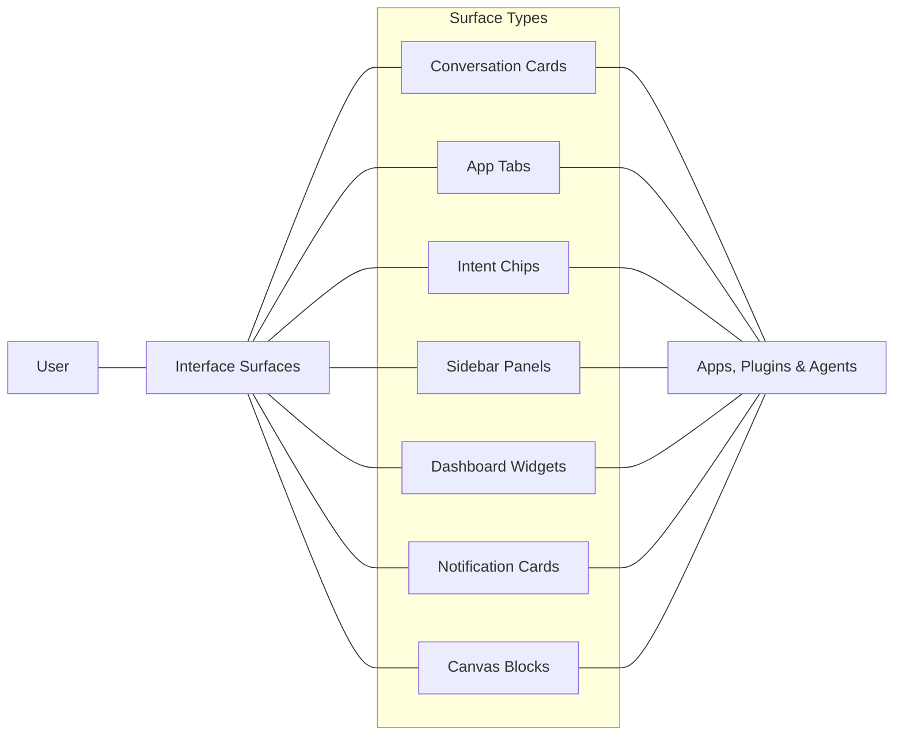

**Interface Surfaces** are standardized UI contexts where offerings (apps, plugins, agents, etc.) can render their user interfaces within the Vibing AI platform. These surfaces provide consistent integration points that maintain a cohesive user experience while allowing offerings to present specialized functionality.

## Overview

Interface Surfaces create a unified design system across the platform while giving developers flexibility in how their offerings interact with users. Each surface type has specific capabilities, constraints, and use cases that make it suitable for different interaction patterns.



## Surface Types

### Conversation Cards

Embedded rich components within chat flows that provide interactive functionality and visual display within conversations.

**Characteristics:**
- Nestable within conversation threads
- Interactive elements and rich media
- Expandable/collapsible content
- Action buttons and controls
- Well-suited for contextual information and actions

**Example Use Cases:**
- Displaying search results within a conversation
- Interactive forms and data collection
- Media players and content previews
- Visualization of data mentioned in conversation

### App Tabs

Full application interfaces that provide comprehensive functionality with dedicated screen space.

**Characteristics:**
- Persistent application state
- Complex layouts and interactions
- Deep platform integration
- Cross-tab navigation
- Extensive functionality

**Example Use Cases:**
- Document editors and content creation tools
- Project management interfaces
- Data analysis and visualization dashboards
- Complex workflow applications

### Intent Chips

Quick action suggestions that appear contextually to help users perform common tasks.

**Characteristics:**
- Compact, focused UI elements
- One-click action triggers
- Contextually relevant suggestions
- Minimal user interaction required
- Clear action labeling

**Example Use Cases:**
- Suggested responses in conversations
- Quick actions based on conversation context
- Common task shortcuts
- Frequently used commands

### Sidebar Panels

Additional context panels that provide supplementary information and controls.

**Characteristics:**
- Persistent or togglable visibility
- Complementary to main workspace
- Reference information and tools
- Quick access to related content
- Non-intrusive UI placement

**Example Use Cases:**
- Document outlines and navigation
- Context-aware help and suggestions
- Related resources and references
- Tool palettes and controls

### Dashboard Widgets

Data visualization and information components for dashboard views.

**Characteristics:**
- Summary information displays
- Data visualization
- Status indicators
- Configurable sizing and placement
- Glanceable information

**Example Use Cases:**
- Project status summaries
- Personal analytics and insights
- Recent activity feeds
- Quick access to common tools

### Notification Cards

Alert and update cards that notify users of important events.

**Characteristics:**
- Time-sensitive information
- Dismissable notifications
- Priority levels
- Action buttons
- Minimal footprint

**Example Use Cases:**
- System alerts and notifications
- Task completion notices
- Incoming message notifications
- Reminder alerts

### Canvas Blocks

Content modules within the canvas workspace for content creation and organization.

**Characteristics:**
- Embeddable content types
- Interactive editing capabilities
- Collaborative features
- Export/import functionality
- Rich media support

**Example Use Cases:**
- Document blocks in a workspace
- Code snippets and examples
- Media galleries and collections
- Interactive diagrams and charts

## Implementation

### Surface Registration

Offerings must register which surfaces they support in their manifest:

```typescript
import { createApp } from '@vibing-ai/sdk/app';
import { surfaces } from '@vibing-ai/sdk/surfaces';

const myApp = createApp({
  name: 'My Application',
  // ...
  surfaces: ['conversationCard', 'appTab', 'sidebarPanel'],
  surfaceSettings: {
    conversationCard: {
      defaultHeight: 'adaptive',
      maxHeight: '500px'
    },
    appTab: {
      icon: './assets/app-icon.png'
    }
  }
});
```

### Surface-specific Rendering

Offerings can render different UIs based on the current surface:

```typescript
import { createApp } from '@vibing-ai/sdk/app';
import { surfaces } from '@vibing-ai/sdk/surfaces';

const myApp = createApp({
  // ...
  onRender: (container, context) => {
    const { surface } = context;
    
    if (surface === 'conversationCard') {
      // Render conversation card UI
    } else if (surface === 'appTab') {
      // Render full app tab UI
    } else {
      // Render default UI
    }
  }
});
```

### Block Kit Integration

Interface Surfaces work seamlessly with the Block Kit component library:

```typescript
import { createApp } from '@vibing-ai/sdk/app';
import { Card, Button, Text } from '@vibing-ai/block-kit';

const myApp = createApp({
  // ...
  onRender: (container) => {
    const card = new Card({
      title: 'My App Card',
      content: [
        new Text('Hello from my app!'),
        new Button('Click me', { onClick: () => alert('Clicked!') })
      ]
    });
    
    card.render(container);
  }
});
```

## Best Practices

### Surface Selection

- Choose the most appropriate surface(s) for your offering's functionality
- Don't request unnecessary surfaces that your offering won't use effectively
- Consider the user's context and workflow when selecting surfaces

### Responsive Design

- Adapt your UI to different surface dimensions
- Use responsive layouts that work across device types
- Test your offering on all supported surfaces and devices

### Consistency

- Maintain consistent behavior across different surfaces
- Reuse UI patterns and components
- Follow platform design guidelines for each surface type

### Performance

- Optimize rendering for each surface type
- Consider resource usage, especially for smaller surfaces
- Lazy-load content when appropriate

## Related Concepts

- [Offering Types](/key-concepts/offering-types) - Different types of platform integrations
- [Vibing Super Agent](/key-concepts/vibing-super-agent) - Central orchestration system
- [Block Kit Library](/developer-guides/block-kit) - UI component library 