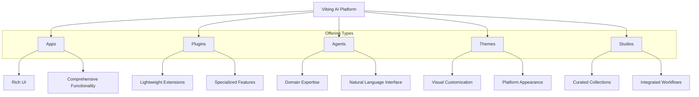

# Offering Types

The Vibing AI platform supports multiple types of **Offerings** that developers can create and publish to the marketplace. Each offering type serves a distinct purpose within the ecosystem, with specific capabilities, integration patterns, and development approaches.

## Overview

Offerings are the building blocks of the Vibing AI ecosystem, allowing developers to extend and enhance the platform in various ways. The platform defines five primary offering types, each with unique characteristics and use cases.



## App

A full-featured application with rich UI and comprehensive functionality.

### Characteristics

- Complete application experience with dedicated interface
- Can implement multiple interface surfaces
- Deep integration with platform capabilities
- Comprehensive user flows and functionality
- Persistent state and data management

### Use Cases

- Document editors and content creation tools
- Project management systems
- Data analysis and visualization dashboards
- Creative tools and design applications
- Media management and playback
- Productivity suites

### Development

Apps are created using the App Framework:

```typescript
import { createApp } from '@vibing-ai/sdk/app';

const myApp = createApp({
  name: 'My Awesome App',
  description: 'Description of my app',
  version: '1.0.0',
  permissions: [
    'memory:read:conversation;purpose=user_context;ttl=session',
    'memory:write:conversation;purpose=conversation_results;ttl=persistent'
  ],
  surfaces: ['conversationCard', 'appTab'],
  onRender: (container, context) => {
    // Render application UI
  },
  onInstall: async () => {
    // Initialization logic
  },
  onUninstall: async () => {
    // Cleanup logic
  }
});
```

## Plugin

A specialized extension that enhances platform functionality, often with minimal UI.

### Characteristics

- Focused on specific capabilities rather than standalone experiences
- Lightweight UI footprint
- Tight integration with core platform
- Can extend other offerings
- Often operates behind the scenes

### Use Cases

- File format converters
- Data connectors and integrations
- Workflow automations
- Content enhancement tools
- Search enhancements
- Message processors

### Development

Plugins are created using the Plugin Framework:

```typescript
import { createPlugin } from '@vibing-ai/sdk/plugin';

const myPlugin = createPlugin({
  name: 'My Productivity Plugin',
  description: 'Enhances productivity',
  version: '1.0.0',
  permissions: [
    'memory:read:global;purpose=user_preferences;ttl=persistent',
    'api:access:calendar;purpose=scheduling;ttl=session'
  ],
  hooks: {
    'message:pre-send': async (message) => {
      // Modify message before sending
      return modifiedMessage;
    },
    'memory:post-write': async (memoryEvent) => {
      // React to memory changes
    }
  },
  actions: {
    createTask: async (params) => {
      // Implementation
      return { success: true };
    }
  }
});
```

## Agent

A specialized AI assistant with domain expertise, primarily using natural language interfaces.

### Characteristics

- Deep knowledge in specific domains
- Natural language interface
- Can use tools and external resources
- Purpose-built for specialized tasks
- Integrated with Vibing Super Agent

### Use Cases

- Research assistants
- Creative partners (writing, design, music)
- Coding experts
- Domain specialists (legal, medical, financial)
- Teaching and training assistants
- Productivity coaches

### Development

Agents are created using the Agent Framework:

```typescript
import { createAgent } from '@vibing-ai/sdk/agent';

const myAgent = createAgent({
  name: 'Specialized Assistant',
  description: 'Expert in specific domain',
  version: '1.0.0',
  capabilities: ['domainExpertise', 'dataAnalysis'],
  permissions: [
    'memory:read:conversation;purpose=context_analysis;ttl=session',
    'tools:use:web_search;purpose=information_retrieval;ttl=request'
  ],
  handles: {
    // Intent handling based on user requests
    'research-topic': async (params, context) => {
      const { topic } = params;
      // Perform research on topic
      return researchResults;
    }
  },
  tools: {
    // Tools the agent can use
    'search-database': async (query) => {
      // Search implementation
      return searchResults;
    }
  },
  onMessage: async (message, context) => {
    // Process message
    return { response: 'Processed response' };
  }
});
```

## Theme

Visual customization for the platform experience.

### Characteristics

- Modifies visual appearance across platform
- Color schemes and typography
- Component styling
- Animation variations
- Accessibility considerations

### Use Cases

- Dark mode and light mode themes
- High-contrast accessibility themes
- Brand-specific themes
- Seasonal or event-based themes
- Industry-specific visual styles
- Aesthetic personalization

### Development

Themes are created using the Theme Framework:

```typescript
import { createTheme } from '@vibing-ai/sdk/theme';
import { colors, typography } from '@vibing-ai/block-kit/theming';

const myTheme = createTheme({
  name: 'Modern Theme',
  description: 'Clean, modern interface',
  version: '1.0.0',
  styles: {
    colors: {
      primary: '#0066cc',
      secondary: '#53a8ff',
      background: '#f5f7fa',
      text: '#333333',
      accent: '#ff9900',
      error: '#dc3545',
      success: '#28a745',
      warning: '#ffc107'
    },
    typography: {
      fontFamily: '"Inter", sans-serif',
      baseSize: '16px',
      headings: {
        fontFamily: '"Poppins", sans-serif',
        weight: 600
      },
      body: {
        lineHeight: 1.5
      }
    },
    spacing: {
      unit: '4px',
      scale: [1, 2, 3, 5, 8, 13]
    },
    components: {
      // Component-specific styling
      button: {
        borderRadius: '4px',
        paddingX: '16px',
        paddingY: '8px'
      },
      card: {
        borderRadius: '8px',
        shadow: '0 2px 8px rgba(0,0,0,0.1)'
      }
    }
  }
});
```

## Studio

A curated collection of offerings for specific workflows.

### Characteristics

- Group of apps, plugins, and agents working together
- Preconfigured settings and permissions
- Customized onboarding flow
- Integrated experience
- Purpose-built for specific workflows

### Use Cases

- Content creation suites
- Project management toolkits
- Research workspaces
- Development environments
- Learning and education bundles
- Industry-specific workspaces

### Development

Studios are created using the Studio Framework:

```typescript
import { createStudio } from '@vibing-ai/sdk/studio';
import { myApp } from './my-app';
import { myPlugin } from './my-plugin';
import { myAgent } from './my-agent';
import { myTheme } from './my-theme';

const myStudio = createStudio({
  name: 'Integrated Workspace',
  description: 'Complete productivity environment',
  version: '1.0.0',
  components: [
    myApp,
    myPlugin,
    myAgent,
    myTheme
  ],
  configuration: {
    // Default settings for included offerings
    myApp: {
      defaultView: 'dashboard'
    },
    myPlugin: {
      autorun: true
    }
  },
  onboarding: {
    steps: [
      {
        title: 'Welcome',
        description: 'Introduction to the studio'
      },
      {
        title: 'Setup',
        description: 'Configure your workspace'
      }
    ]
  }
});
```

## Integration Patterns

### Standalone vs. Integrated

- **Standalone** offerings provide complete experiences on their own
- **Integrated** offerings work with other components to enhance functionality

### Conversational vs. UI-Driven

- **Conversational** offerings primarily use natural language interfaces
- **UI-Driven** offerings provide graphical interfaces for interaction

### Tool vs. Experience

- **Tool** offerings focus on specific tasks and functionality
- **Experience** offerings create immersive environments

## Marketplace Submission

When preparing to submit an offering to the marketplace, developers need to:

1. Choose the appropriate offering type
2. Implement required interfaces and hooks
3. Specify permissions with clear purposes
4. Define which interface surfaces are supported
5. Provide comprehensive documentation
6. Submit for review and approval

```bash
# Validate before submission
vibe validate --pre-submit

# Package for submission
vibe package

# Submit through CLI
vibe submit
```

## Best Practices

### Choosing the Right Offering Type

- **Use an App** when building a comprehensive experience with rich UI
- **Use a Plugin** when extending platform functionality with minimal UI
- **Use an Agent** when providing domain-specific AI assistance
- **Use a Theme** when customizing visual appearance
- **Use a Studio** when curating multiple offerings for specific workflows

### Development Guidelines

- Focus on one offering type initially before expanding
- Ensure clear boundaries between different offerings
- Request only the permissions necessary for functionality
- Design for interoperability with other offerings
- Follow platform design guidelines and best practices

## Related Concepts

- [Vibing Super Agent](/key-concepts/vibing-super-agent) - Central orchestration system
- [Interface Surfaces](/key-concepts/interface-surfaces) - UI contexts for offerings
- [Permission Model](/key-concepts/permission-model) - Security framework for access control
- [Unified Memory System](/key-concepts/unified-memory-system) - Shared context system 