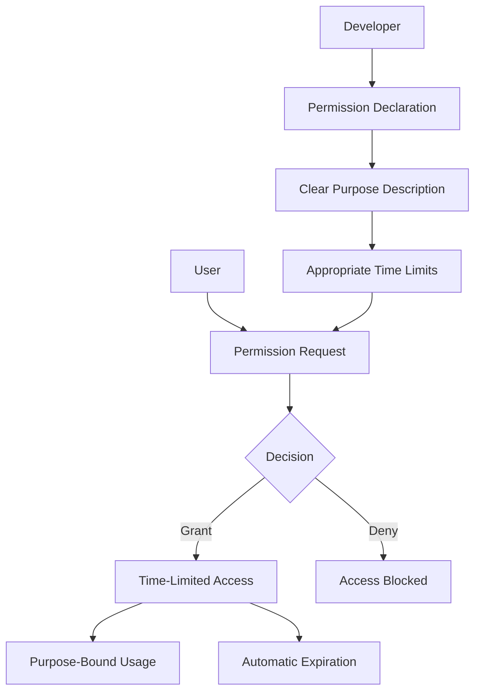

# Permission Model

The **Permission Model** is a foundational security framework within the Vibing AI platform that governs how offerings (apps, plugins, agents, etc.) access user data and platform capabilities. It implements purpose-bound, time-limited authorizations that put users in control of their AI experience.

## Overview

Vibing AI's permission model differs from traditional permission systems by requiring not just *what* an offering wants to access, but *why* it needs access and *for how long*. This approach dramatically increases transparency and control for users while ensuring developers can still build powerful, contextually-aware offerings.



## Permission Format

All permissions follow a standardized format:

```
resource:action:scope;purpose=explanation;ttl=duration
```

Components of this format include:

- **Resource**: What is being accessed (memory, files, API, etc.)
- **Action**: The operation being performed (read, write, execute, etc.)
- **Scope**: The specific instance or range being accessed
- **Purpose**: Required explanation of why access is needed
- **TTL**: Time-to-live duration for the permission (e.g., session, 1h, 30d)

### Examples

```
memory:read:conversation;purpose=user_context;ttl=session
```
*Allows reading conversation memory for user context during the current session only*

```
files:write:documents/{id};purpose=save_user_content;ttl=7d
```
*Allows writing to a specific document for the purpose of saving user content for 7 days*

```
api:access:calendar;purpose=scheduling;ttl=1h
```
*Allows access to the calendar API for scheduling purposes for 1 hour*

## Permission Levels

Permissions are categorized into different sensitivity levels:

### Critical
- Requires explicit user approval each time
- Typically involves highly sensitive operations or data
- Examples: Sending messages on behalf of the user, accessing payment information

### Sensitive
- Requires explicit approval once with specific scope
- Typically involves personal data or significant platform capabilities
- Examples: Accessing user files, using the camera/microphone, connecting to external services

### Standard
- Can be granted during installation with clear disclosure
- Typically involves basic platform functionality
- Examples: Basic memory access with clear purpose, rendering on certain surfaces

### Basic
- Implied by platform usage
- Minimal risk capabilities
- Examples: Accessing public platform resources, using Block Kit components

## Resource Types

The permission model covers various resource types:

### Memory
Access to the Unified Memory System with different scopes:

- **Global**: Cross-project persistent memory
- **Workspace**: Shared memory within a workspace
- **Project**: Project-specific memory
- **Session**: Current interaction session memory
- **Private**: Offering-specific isolated memory

Example: `memory:write:project:{id};purpose=save_project_state;ttl=90d`

### Files
Access to user files and storage:

- Reading files
- Writing/modifying files
- Creating new files
- Deleting files

Example: `files:read:images/*;purpose=image_processing;ttl=1h`

### Network
Access to external APIs and services:

- Specific domains
- API categories
- Data transport

Example: `network:external:*.example.com;purpose=data_retrieval;ttl=request`

### Sensors
Access to device capabilities:

- Camera
- Microphone
- Location
- Other sensors

Example: `sensors:access:microphone;purpose=voice_recording;ttl=15m`

### Offerings
Ability to use or control other offerings:

- Invoking other offerings
- Reading offering data
- Controlling offering behavior

Example: `offerings:invoke:plugin-id;purpose=workflow_automation;ttl=30d`

### User
Interaction with the user:

- Sending notifications
- Requesting input
- Displaying UI

Example: `user:notify:push;purpose=task_reminders;ttl=90d`

## Permission Lifecycle

### Requesting Permissions

Developers declare required permissions in their offering manifest:

```typescript
import { createApp } from '@vibing-ai/sdk/app';

const myApp = createApp({
  name: 'My Application',
  version: '1.0.0',
  permissions: [
    'memory:read:project;purpose=content_analysis;ttl=session',
    'memory:write:project;purpose=save_user_data;ttl=session',
    'files:read:documents/*;purpose=document_processing;ttl=30d'
  ],
  // ...
});
```

For runtime permission requests:

```typescript
import { permissions } from '@vibing-ai/sdk/permissions';

// Request additional permissions at runtime
const granted = await permissions.request([
  'sensors:access:microphone;purpose=voice_recording;ttl=15m'
]);

if (granted) {
  // Permission granted, proceed with functionality
} else {
  // Permission denied, degrade gracefully
}
```

### Checking Permissions

```typescript
import { permissions } from '@vibing-ai/sdk/permissions';

// Check if a permission is currently granted
const hasPermission = await permissions.check(
  'memory:write:global;purpose=user_preferences;ttl=persistent'
);

if (hasPermission) {
  // Permission is active
} else {
  // Permission is not granted or has expired
}
```

### Revoking Permissions

Users can view and revoke permissions at any time through the platform interface. Developers can also programmatically revoke permissions they no longer need:

```typescript
import { permissions } from '@vibing-ai/sdk/permissions';

// Revoke a permission that's no longer needed
await permissions.revoke(
  'sensors:access:microphone;purpose=voice_recording'
);
```

## Best Practices

### For Developers

1. **Request minimal permissions** - Only ask for what you need
2. **Be specific about scope** - Narrow the scope to exactly what's required
3. **Provide clear purpose statements** - Explain in user-friendly terms why the permission is needed
4. **Use appropriate TTLs** - Request access for appropriate durations
5. **Degrade gracefully** - Handle denied permissions without breaking your offering
6. **Release permissions early** - Revoke permissions when no longer needed

### For Users

1. **Review permissions carefully** - Understand what you're granting access to
2. **Check purpose statements** - Ensure the reason for access makes sense
3. **Consider time limits** - Note how long the permission will last
4. **Regularly audit permissions** - Review and revoke unnecessary permissions
5. **Report suspicious requests** - Flag offerings that request excessive permissions

## Security Considerations

The permission model is a core component of the platform's zero-trust security architecture:

- All permissions are verified on each access attempt
- Permission grants are cryptographically signed to prevent tampering
- Detailed audit logs track permission grants, uses, and revocations
- Permission enforcement occurs at multiple system layers
- Time limits are strictly enforced with automatic expiration

## Related Concepts

- [Vibing Super Agent](/key-concepts/vibing-super-agent) - Uses the permission model for orchestration
- [Unified Memory System](/key-concepts/unified-memory-system) - Protected by memory permissions
- [Offering Types](/key-concepts/offering-types) - Different offerings require different permissions 