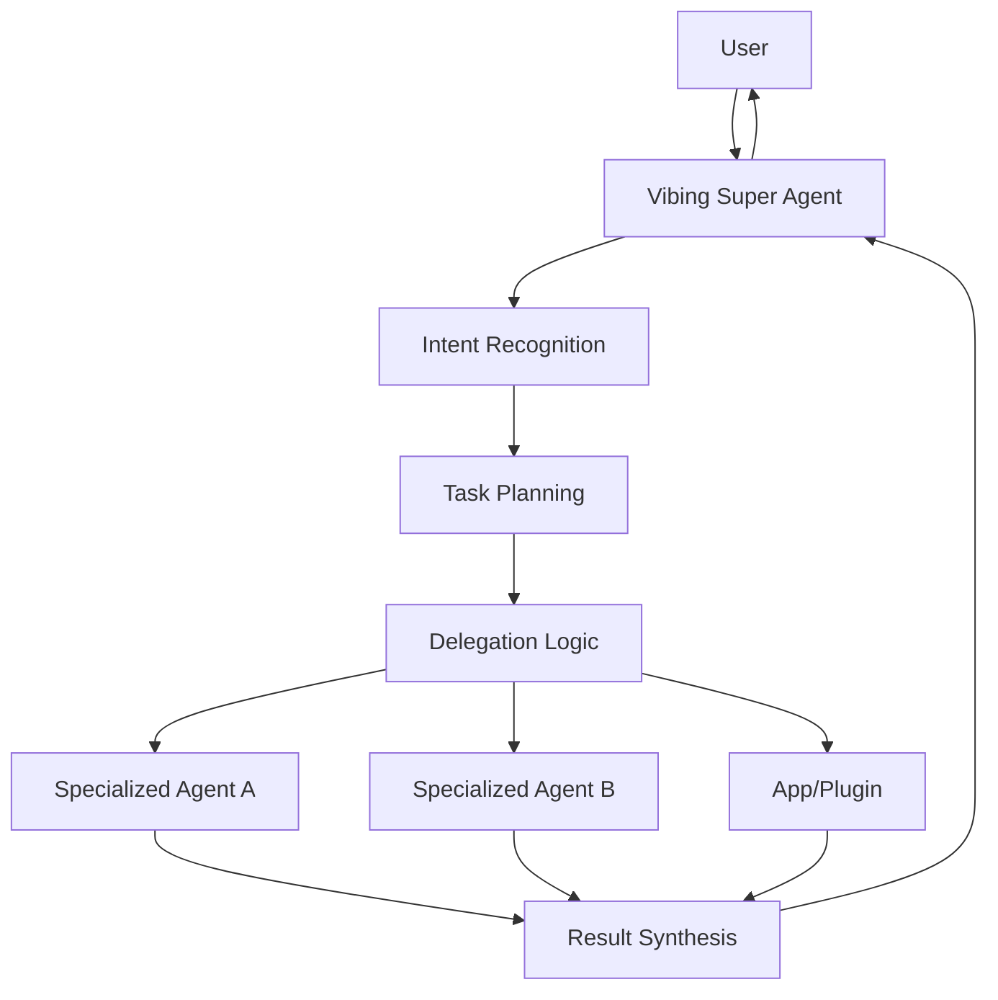

The **Vibing Super Agent** is the central orchestrating intelligence at the core of the Vibing AI platform. It functions as a sophisticated AI coordinator that manages interactions between users, specialized agents, and platform offerings.

## Overview

The Vibing Super Agent acts as the primary intelligence layer, intelligently routing user requests to the most appropriate specialized agents or applications. Rather than attempting to be an expert in all domains, it excels at understanding user intent and delegating tasks to purpose-built AI agents or applications with domain-specific expertise.



## Key Capabilities

### Intent Recognition
The Super Agent analyzes user input to determine the appropriate action path, identifying the underlying intent and objectives.

### Task Planning
For complex requests, the Super Agent breaks down tasks into actionable steps that can be executed by specialized agents or platform offerings.

### Delegation Logic
Based on intent recognition and task planning, the Super Agent routes tasks to the most appropriate specialized agents, apps, or plugins.

### Context Management
Throughout interactions, the Super Agent maintains a coherent state by leveraging the Unified Memory System to provide relevant context for all components involved.

### Execution Flow
The Super Agent coordinates multi-step processes across different offerings, ensuring smooth transitions and information sharing.

### Result Synthesis
After receiving outputs from multiple sources, the Super Agent integrates and refines the information into a cohesive response for the user.

### Explanation System
For transparency, the Super Agent provides clear explanations of its decision-making process and the contributions of various specialized agents.

## Integration with Specialized Agents

Developers can create specialized agents that integrate with the Vibing Super Agent:

```typescript
import { createAgent } from '@vibing-ai/sdk/agent';

const myAgent = createAgent({
  name: 'Domain Expert',
  description: 'Expert in specific domain',
  version: '1.0.0',
  capabilities: ['domainExpertise', 'dataAnalysis'],
  permissions: [
    'memory:read:conversation;purpose=context_analysis;ttl=session',
    'tools:use:web_search;purpose=information_retrieval;ttl=request'
  ],
  onInvoke: async (request, context) => {
    // Handle invocation from Super Agent
    return { response: 'Specialized knowledge response' };
  }
});

// Listen for requests from Super Agent
myAgent.on('request', async (req) => {
  // Process request from Super Agent
  // req contains the context and specifics of the request
});
```

## Control Modes

The Vibing Super Agent supports different control modes that determine the level of autonomy:

1. **Manual Mode**: Requires explicit user confirmation for each action
2. **Co-Pilot Mode**: Suggests actions but waits for user approval on significant steps
3. **Auto-Pilot Mode**: Operates with greater autonomy for routine or pre-approved tasks

Users can adjust these control modes based on their preferences and the specific context of their work.

## Security & Permissions

The Vibing Super Agent adheres to the platform's permission model, requiring explicit authorization for accessing user data or performing actions. Each operation is purpose-bound and time-limited to ensure security and privacy.

For example, when the Super Agent delegates a task to a specialized agent, it only provides the necessary context and permissions required for that specific task, following the principle of least privilege.

## Developer Considerations

When building offerings that interact with the Vibing Super Agent, developers should:

1. **Define clear capabilities** to help the Super Agent understand when to invoke your offering
2. **Implement focused functionality** rather than attempting to handle all use cases
3. **Provide context-aware responses** that can be integrated into larger workflows
4. **Respect permission boundaries** by requesting only what's necessary for your offering's functionality
5. **Support explainability** by providing clear information about your offering's decision-making process

## API Endpoints

The platform provides dedicated endpoints for interacting with the Vibing Super Agent:

```