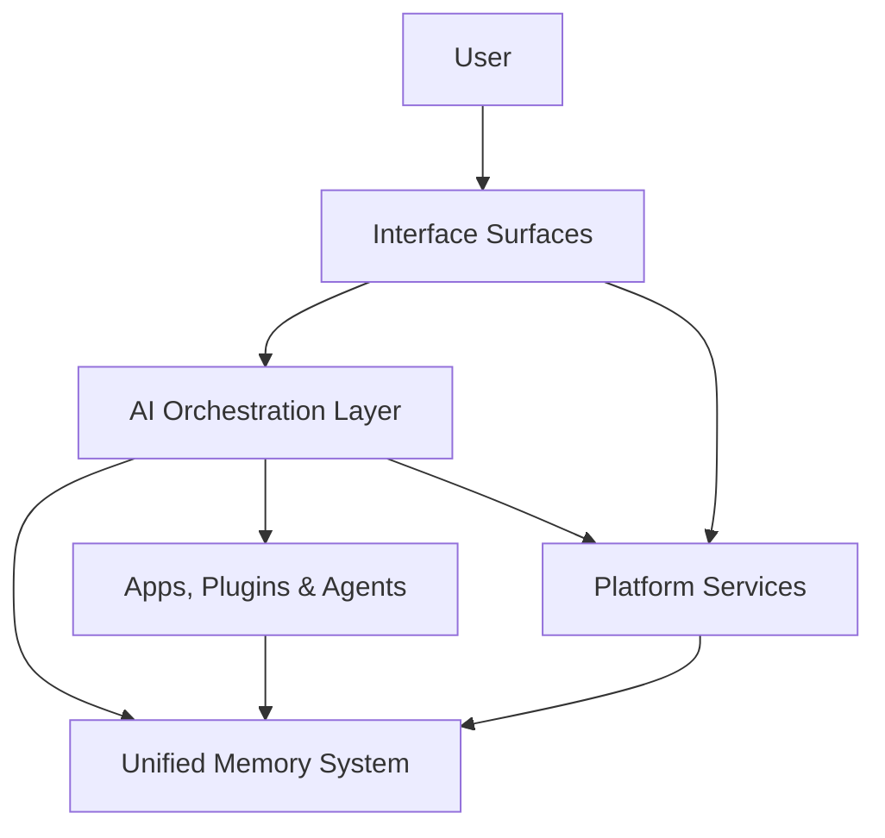

# Vibing AI: Technical Blueprint & Architecture Guide

## Introduction

### 1.1 Purpose & Scope

This document outlines the technical architecture and implementation blueprint for the **Vibing AI** platform - a pioneering AI operating system that orchestrates specialized AI applications while prioritizing user control, privacy, and a seamless experience.

This technical blueprint covers:
- Core architecture principles and design decisions
- System components and their interactions
- Platform models and abstractions
- Security framework and privacy controls
- Developer platform specifications
- API details and integration patterns
- Infrastructure and scaling approach

### 1.2 Core Principles

These principles guide all technical decisions within the platform architecture:

1. **User-Controlled AI**: All AI operations require explicit, purpose-bound permissions with clear time limitations
2. **Security by Design**: Zero-trust architecture with end-to-end encryption and rigorous permission enforcement
3. **Developer Empowerment**: Streamlined SDK, comprehensive documentation, and fair revenue sharing
4. **Contextual Intelligence**: **Unified Memory System** with cross-app awareness and knowledge persistence
5. **Modularity**: Extensible system of specialized applications with clear boundaries and interfaces
6. **Performance**: Optimized for low latency, high throughput, and efficient resource utilization
7. **Accessibility**: Platform designed for universal access regardless of device or ability

## 2. System Architecture

### 2.1 Architecture Overview

The **Vibing AI** platform employs a sophisticated multi-layered architecture that combines cloud-based and client-side components.



The architecture includes these primary layers:

1. **Interface Surfaces** - User-facing interaction points across devices
2. **AI Orchestration** - Manages the **Vibing Super Agent** and specialized offerings
3. **Unified Memory System** - Shared context and knowledge persistence
4. **Platform Services** - Core system capabilities and infrastructure
5. **Developer SDK** - Tools and frameworks for building on the platform

### 2.2 Key Components

#### 2.2.1 Interface Surfaces

The user-facing presentation layer supporting multiple interaction modes:

- **Conversation** - Chat-based interface with natural language processing
- **App Tabs** - Full-fledged application interfaces with rich interactions
- **Canvas** - Flexible workspace for content creation and organization
- **Intent Chips** - Contextual suggestions for common actions
- **Context Panels** - Supplementary information and controls
- **Dashboard** - Personal workspace with customizable information displays
- **Command Palette** - Universal keyboard-driven command interface

#### 2.2.2 AI Orchestration Layer

Coordinates interaction between the **Vibing Super Agent** and specialized offerings:

- **Intent Recognition** - Analyzes user input to determine appropriate actions
- **Task Planning** - Breaks complex requests into actionable steps
- **Delegation Logic** - Routes tasks to appropriate specialized agents
- **Context Management** - Maintains coherent state across interactions
- **Execution Flow** - Coordinates multi-step processes across offerings
- **Result Synthesis** - Combines outputs from multiple sources
- **Explanation System** - Provides transparency into AI decision-making

#### 2.2.3 Unified Memory System

Persistent storage system providing cross-application context:

- **Vectorized Memory** - Semantic storage with retrieval by meaning
- **Structured Records** - Typed data storage with schema validation
- **Hierarchical Organization** - Nested contexts for different scopes
- **Permission System** - Granular access controls with purpose declarations
- **Temporal Management** - Historical versioning and time-based constraints
- **Notification System** - Event-based triggers for memory changes
- **Search Capabilities** - Advanced retrieval across memory spaces

#### 2.2.4 Platform Services

Core infrastructure components supporting the system:

- **Authentication** - User identity verification and session management
- **Authorization** - Permission checking and access control
- **Storage** - Secure data persistence with encryption
- **Analytics** - Usage tracking and performance monitoring
- **Marketplace** - Discovery and distribution for third-party offerings
- **Billing** - Subscription management and payment processing
- **Content Safety** - Moderation and compliance enforcement

#### 2.2.5 Developer SDK

Tools and frameworks for building platform offerings:

- **App Framework** - Structure for building full applications
- **Plugin System** - Lightweight extension capabilities
- **Agent Framework** - Tools for creating specialized AI assistants
- **Theme System** - Visual customization capabilities
- **Studio Composer** - Tools for creating offering collections
- **Testing Tools** - Validation and quality assurance
- **Build Pipeline** - Package and deployment automation

## 3. Platform Models

The platform defines several key models that represent core abstractions within the system.

### 3.1 Offering Model

Five types of offerings are supported in the marketplace:

1. **App**: Full-featured application with rich UI and comprehensive functionality
   - Complete application experience with dedicated interface
   - Can implement multiple surfaces
   - Deep integration with platform capabilities
   - Example: Document editor, project manager, or design tool

2. **Plugin**: Specialized extension that enhances platform functionality
   - Focused on specific capabilities rather than standalone experience
   - Lightweight UI footprint
   - Tight integration with core platform
   - Example: File format converter, specialized search, or data connector
   
3. **Agent**: Specialized AI assistant with domain expertise
   - Natural language interface primarily
   - Deep knowledge in specific domain
   - Can use tools and external resources
   - Example: Research assistant, coding expert, or creative partner

4. **Theme**: Visual customization for platform experience
   - Color schemes and typography
   - Component styling
   - Animation variations
   - Example: Dark mode, high-contrast accessibility, or branded experience

5. **Studio**: Curated collection of offerings for specific workflows
   - Group of apps, plugins, and agents working together
   - Preconfigured settings and permissions
   - Customized onboarding flow
   - Example: Content creation studio, project management suite, or research toolkit

### 3.2 Memory Model

The **Unified Memory System** is organized hierarchically with different scopes:

1. **Global Memory**: Persistent across all contexts
   - User profile and preferences
   - Long-term knowledge and history
   - Cross-project information
   - Permission: `memory:read:global;purpose=user_preferences;ttl=session`

2. **Workspace Memory**: Shared across a collection of projects
   - Workspace configuration
   - Team members and access rights
   - High-level objectives and resources
   - Permission: `memory:write:workspace:{id};purpose=team_collaboration;ttl=30d`

3. **Project Memory**: Associated with a specific project
   - Project-specific content and assets
   - Project history and versions
   - Specialized knowledge for the project domain
   - Permission: `memory:read:project:{id};purpose=content_generation;ttl=1h`

4. **Session Memory**: Limited to the current interaction session
   - Short-term conversation context
   - Temporary data and calculations
   - Ephemeral states
   - Permission: `memory:read:session;purpose=conversation_context;ttl=30m`

5. **Private Memory**: Isolated to a specific offering
   - Offering-specific data
   - User settings for the offering
   - Processing history
   - Permission: `memory:write:private:{offering_id};purpose=feature_personalization;ttl=90d`

### 3.3 Permission Model

Fine-grained permission system with purpose-bound and time-limited authorization:

1. **Permission Format**: `resource:action:scope;purpose=explanation;ttl=duration`
   - **Resource**: What is being accessed (memory, files, API, etc.)
   - **Action**: The operation being performed (read, write, execute, etc.)
   - **Scope**: The specific instance or range being accessed
   - **Purpose**: Required explanation of why access is needed
   - **TTL**: Time-to-live duration for the permission

2. **Permission Levels**:
   - **Critical**: Requires explicit user approval each time
   - **Sensitive**: Requires explicit approval once with specific scope
   - **Standard**: Can be granted during installation with clear disclosure
   - **Basic**: Implied by platform usage

3. **Resource Types**:
   - **Memory**: Access to the **Unified Memory System**
   - **Files**: Access to user files and storage
   - **Network**: External API and service access
   - **Sensors**: Device capabilities (camera, microphone, location)
   - **Offerings**: Ability to use or control other offerings
   - **User**: Interaction with the user (notifications, prompts)

4. **Revocation**: All permissions can be viewed and revoked by the user at any time

### 3.4 Event Model

An event-driven architecture enables loosely coupled components:

1. **Event Types**:
   - **System Events**: Platform-level operations and state changes
   - **Memory Events**: Changes to the **Unified Memory System**
   - **User Events**: User actions and input
   - **Offering Events**: Operations within specific offerings
   - **Integration Events**: Interactions with external systems

2. **Event Format**: Standardized event payload structure
   - **ID**: Unique identifier
   - **Type**: Event category and specific type
   - **Source**: Originating component
   - **Timestamp**: When the event occurred
   - **Payload**: Event-specific data
   - **Context**: Related information and references

3. **Event Subscription**: Components can subscribe to specific event types
   - Filtered by event type, source, or payload properties
   - Scoped to specific contexts or projects
   - Permission-controlled access

### 3.5 Interface Surface Model

Standardized UI contexts for offering presentation:

1. **Conversation Cards**: Rich message components within chat
   - Interactive elements and visualizations
   - Expandable/collapsible content
   - Action buttons and controls
   - Contextual state

2. **Application Tabs**: Full application interfaces
   - Complex layouts and interactions
   - Persistent application state
   - Deep platform integration
   - Cross-tab navigation

3. **Canvas Blocks**: Content modules within canvas
   - Embeddable content types
   - Interactive editing capabilities
   - Collaborative features
   - Export/import functionality

4. **Context Panels**: Supplementary information displays
   - Related content and suggestions
   - Quick actions and tools
   - Reference information
   - Lightweight controls

5. **Dashboard Widgets**: Information displays for dashboard
   - Status indicators
   - Summary visualizations
   - Recent activity feeds
   - Quick access controls

## 4. Security Framework

### 4.1 Security Architecture

A comprehensive security model protects user data and system integrity:

1. **Zero-Trust Model**: No implicit trust regardless of network location
   - All access requires authentication and authorization
   - Least privilege principle for all operations
   - Continuous verification of identity and permissions
   - Micro-segmentation of system components

2. **End-to-End Encryption**: Data protected throughout its lifecycle
   - Transit encryption using TLS 1.3+
   - At-rest encryption for all stored data
   - Client-side encryption for sensitive content
   - Key rotation and management

3. **Sandboxed Execution**: Isolated environments for offerings
   - Resource limitations and monitoring
   - Restricted API access
   - Runtime protection
   - Code signing and verification

4. **Audit and Logging**: Comprehensive tracking of security events
   - Detailed activity logs for security analysis
   - Tamper-evident logging
   - Real-time alerting for suspicious activities
   - Compliance reporting

### 4.2 Authentication System

Multi-layered authentication protects user accounts and sessions:

1. **User Authentication**:
   - Email/password with strong password requirements
   - Multi-factor authentication (MFA) options
   - Social authentication with security verification
   - Biometric options on supported devices
   - Enterprise SSO integration

2. **Session Management**:
   - Short-lived access tokens
   - Rotating refresh tokens
   - Secure cookie handling
   - Session monitoring for anomalies
   - Concurrent session limits and visibility

3. **API Authentication**:
   - OAuth 2.1 authorization
   - JWT with appropriate security measures
   - Rate limiting and throttling
   - Scoped API tokens for offerings

### 4.3 Privacy Controls

Advanced privacy measures protect user data and preferences:

1. **Data Minimization**: Collection limited to necessary information
   - Purpose specification for all data collection
   - Retention limits with automatic expiration
   - Anonymization where appropriate
   - Data collection transparency

2. **User Consent**: Clear permission flows for data access
   - Granular consent options
   - Easy-to-understand permission requests
   - Revocable permissions
   - Consent records and history

3. **Privacy by Design**:
   - Privacy impact assessments
   - Data protection by default
   - Privacy-enhancing technologies
   - Regular privacy audits

## 5. Developer Platform

### 5.1 SDK Organization

The developer SDK is organized into logical modules:

```
@vibing-ai/sdk/
├── app/             # App development framework
├── plugin/          # Plugin development utilities
├── agent/           # Agent development tools
├── theme/           # Theme development framework
├── studio/          # Studio composition tools
├── memory/          # Unified Memory System integration
├── permissions/     # Permission management
├── events/          # Event system integration
├── surfaces/        # Interface surface components
├── auth/            # Authentication utilities
├── ai/              # AI capabilities and integrations
└── utils/           # Common utilities and helpers
```

**Core Import Pattern**:
```typescript
// App-specific imports
import { createApp } from '@vibing-ai/sdk/app';

// Plugin-specific imports
import { createPlugin } from '@vibing-ai/sdk/plugin';

// Service imports
import { memory } from '@vibing-ai/sdk/memory';
import { permissions } from '@vibing-ai/sdk/permissions';
import { events } from '@vibing-ai/sdk/events';
```

### 5.2 Development Workflow

The platform provides a streamlined development experience:

1. **Project Initialization**:
   ```bash
   # Create a new app project
   vibe init my-app --type app
   
   # Create a new plugin project
   vibe init my-plugin --type plugin
   
   # Create a new agent project
   vibe init my-agent --type agent
   ```

2. **Local Development**:
   ```bash
   # Start development server
   vibe dev
   
   # Run with specific environment
   vibe dev --env production
   
   # Run with debugger
   vibe dev --debug
   ```

3. **Testing**:
   ```bash
   # Run tests
   vibe test
   
   # Run specific test file
   vibe test path/to/test
   
   # Run with coverage
   vibe test --coverage
   ```

4. **Building**:
   ```bash
   # Build for production
   vibe build
   
   # Build with specific target
   vibe build --target web
   
   # Build with optimization
   vibe build --optimize
   ```

5. **Deployment**:
   ```bash
   # Validate before deployment
   vibe validate
   
   # Deploy to marketplace
   vibe deploy
   
   # Deploy specific version
   vibe deploy --version 1.2.3
   ```

### 5.3 Block Kit UI Framework

Component library for building consistent interfaces:

1. **Core Components**:
   - Layout: Container, Grid, Stack, Divider
   - Typography: Heading, Text, Link, Code
   - Inputs: Button, TextField, Select, Checkbox
   - Feedback: Alert, Toast, Progress, Spinner
   - Data Display: Card, Table, List, Badge
   - Navigation: Tabs, Breadcrumb, Menu, Pagination

2. **Theming System**:
   - Design tokens for colors, spacing, typography
   - Component-specific styling options
   - Dark mode and high-contrast support
   - Responsive design utilities

3. **Usage Pattern**:
   ```typescript
   import { Card, Text, Button } from '@vibing-ai/block-kit';
   
   function MyComponent() {
     return (
       <Card>
         <Text variant="heading">Hello World</Text>
         <Button variant="primary">Click Me</Button>
       </Card>
     );
   }
   ```

### 5.4 Building Block Types

Key frameworks for creating different offering types:

#### 5.4.1 App Framework

Structure for building full applications:

```typescript
import { createApp } from '@vibing-ai/sdk/app';
import { memory } from '@vibing-ai/sdk/memory';

const myApp = createApp({
  name: 'My Application',
  version: '1.0.0',
  permissions: [
    'memory:read:project;purpose=content_analysis;ttl=session',
    'memory:write:project;purpose=save_user_data;ttl=session'
  ],
  surfaces: {
    app: AppComponent,
    conversation: ConversationComponent,
    canvas: CanvasComponent
  },
  onInstall: async () => {
    // Initialization logic
  },
  onUninstall: async () => {
    // Cleanup logic
  }
});
```

#### 5.4.2 Plugin Framework

System for creating lightweight extensions:

```typescript
import { createPlugin } from '@vibing-ai/sdk/plugin';
import { events } from '@vibing-ai/sdk/events';

const myPlugin = createPlugin({
  name: 'My Plugin',
  version: '1.0.0',
  permissions: [
    'memory:read:session;purpose=context_awareness;ttl=session'
  ],
  hooks: {
    'message:pre-send': async (message) => {
      // Modify message before sending
      return modifiedMessage;
    },
    'memory:post-write': async (memoryEvent) => {
      // React to memory changes
    }
  },
  commands: {
    'my-command': async (args) => {
      // Handle custom command
      return result;
    }
  }
});
```

#### 5.4.3 Agent Framework

Tools for building specialized AI assistants:

```typescript
import { createAgent } from '@vibing-ai/sdk/agent';
import { memory } from '@vibing-ai/sdk/memory';

const myAgent = createAgent({
  name: 'My Agent',
  version: '1.0.0',
  description: 'A specialized agent for specific tasks',
  capabilities: ['research', 'analysis', 'recommendation'],
  permissions: [
    'memory:read:project;purpose=domain_knowledge;ttl=session',
    'network:external:*.example.com;purpose=data_retrieval;ttl=request'
  ],
  handles: {
    // Intent handling based on user requests
    'research-topic': async (params, context) => {
      const { topic } = params;
      // Perform research on topic
      return researchResults;
    }
  },
  tools: {
    // Tools the agent can use
    'search-database': async (query) => {
      // Search implementation
      return searchResults;
    }
  }
});
```

## 6. API Specifications

### 6.1 API Design Principles

The platform APIs follow these core principles:

1. **RESTful Resources**: Resource-oriented design with standard HTTP methods
2. **Consistent Patterns**: Uniform request/response formats across endpoints
3. **Versioned Endpoints**: Explicit versioning for stability and evolution
4. **Comprehensive Documentation**: OpenAPI specifications with examples
5. **Error Handling**: Detailed error responses with actionable information
6. **Rate Limiting**: Transparent usage limits with clear headers
7. **Idempotent Operations**: Safe retries for network instability

### 6.2 Core Endpoints

#### 6.2.1 Authentication Endpoints

```
POST /api/v1/auth/login
POST /api/v1/auth/logout
POST /api/v1/auth/refresh
POST /api/v1/auth/register
POST /api/v1/auth/verify
POST /api/v1/auth/password/reset
```

#### 6.2.2 Unified Memory System Endpoints

```
GET    /api/v1/memory/{scope}/{id}
POST   /api/v1/memory/{scope}/{id}
PUT    /api/v1/memory/{scope}/{id}
DELETE /api/v1/memory/{scope}/{id}
GET    /api/v1/memory/{scope}/{id}/history
POST   /api/v1/memory/search
```

#### 6.2.3 Permission Endpoints

```
GET    /api/v1/permissions
POST   /api/v1/permissions/request
PUT    /api/v1/permissions/{id}
DELETE /api/v1/permissions/{id}
GET    /api/v1/permissions/history
```

#### 6.2.4 Marketplace Endpoints

```
GET    /api/v1/marketplace/offerings
GET    /api/v1/marketplace/offerings/{id}
POST   /api/v1/marketplace/offerings/search
POST   /api/v1/marketplace/offerings/install
DELETE /api/v1/marketplace/offerings/uninstall/{id}
GET    /api/v1/marketplace/categories
GET    /api/v1/marketplace/collections
```

#### 6.2.5 Vibing Super Agent Endpoints

```
POST   /api/v1/agent/message
GET    /api/v1/agent/conversation/{id}
POST   /api/v1/agent/conversation/{id}/message
PUT    /api/v1/agent/conversation/{id}/title
DELETE /api/v1/agent/conversation/{id}
GET    /api/v1/agent/conversations
```

#### 6.2.6 User Endpoints

```
GET    /api/v1/user/profile
PUT    /api/v1/user/profile
GET    /api/v1/user/settings
PUT    /api/v1/user/settings
GET    /api/v1/user/offerings
```

### 6.3 Webhook System

Event notifications for external integrations:

1. **Subscription Management**:
   ```
   POST   /api/v1/webhooks
   GET    /api/v1/webhooks
   GET    /api/v1/webhooks/{id}
   PUT    /api/v1/webhooks/{id}
   DELETE /api/v1/webhooks/{id}
   ```

2. **Event Types**:
   - `offering.installed` - New offering installed
   - `offering.uninstalled` - Offering removed
   - `conversation.created` - New conversation started
   - `memory.updated` - Significant memory update
   - `user.settings.changed` - User settings modified

3. **Payload Format**:
   ```json
   {
     "id": "evt_12345",
     "type": "offering.installed",
     "created": "2023-06-15T12:34:56Z",
     "data": {
       "offering_id": "off_67890",
       "offering_name": "Example App",
       "offering_type": "app",
       "user_id": "usr_abcde"
     }
   }
   ```

4. **Security**:
   - HMAC signature verification
   - Automatic retry with exponential backoff
   - Event delivery logs
   - IP allowlisting

### 6.4 Integration Framework

Tools for connecting with external systems:

1. **OAuth Integration**:
   ```
   GET    /api/v1/integrations
   POST   /api/v1/integrations/{provider}/connect
   DELETE /api/v1/integrations/{provider}/disconnect
   GET    /api/v1/integrations/{provider}/status
   ```

2. **Data Import/Export**:
   ```
   POST   /api/v1/import
   GET    /api/v1/export
   GET    /api/v1/export/{id}/status
   GET    /api/v1/export/{id}/download
   ```

3. **API Gateways**:
   Secure proxies for accessing trusted external services:
   ```
   POST   /api/v1/gateway/{service}/{endpoint}
   ```

## 7. Deployment & Infrastructure

### 7.1 Hosting & Infrastructure

Cloud-based infrastructure with edge components:

1. **Backend Services**: Kubernetes-based microservices
   - Docker containerization
   - Horizontal pod autoscaling
   - Multi-region deployment
   - Blue/green deployment strategy

2. **Database Layer**: Distributed database systems
   - Relational database for structured data
   - Document database for flexible schemas
   - Vector database for semantic search
   - In-memory database for caching

3. **Edge Network**: Global CDN with edge computing
   - Static asset delivery
   - Edge caching
   - Regional data residency
   - DDoS protection

4. **Client Applications**: Cross-platform compatibility
   - Progressive Web App (PWA)
   - Native mobile applications
   - Desktop applications
   - Embedded integrations

### 7.2 Scalability Architecture

Design for massive scale with distributed components:

1. **Horizontal Scaling**: Add capacity by increasing instance count
   - Stateless service design
   - Connection pooling
   - Distributed caching
   - Load balancing

2. **Vertical Partitioning**: Split services by functionality
   - Bounded contexts
   - Domain-specific services
   - Clear API boundaries
   - Independent scaling

3. **Data Partitioning**: Distribute data across multiple stores
   - Sharding strategies
   - Multi-tenancy isolation
   - Read replicas
   - Write distribution

4. **Resilience Patterns**:
   - Circuit breakers
   - Retry with backoff
   - Rate limiting
   - Graceful degradation
   - Chaos engineering

### 7.3 Development & Testing

Comprehensive development and quality assurance approach:

1. **Development Environments**:
   - Local development with minimal dependencies
   - Integration environment with full services
   - Staging environment mirroring production
   - Production environment

2. **Testing Strategy**:
   - Unit testing for components
   - Integration testing for service interactions
   - End-to-end testing for user flows
   - Performance testing for scalability
   - Security testing for vulnerabilities

3. **CI/CD Pipeline**:
   - Automated builds on commit
   - Test automation suite
   - Static code analysis
   - Vulnerability scanning
   - Automated deployment
   - Canary releases

4. **Monitoring & Observability**:
   - Distributed tracing
   - Centralized logging
   - Metrics collection
   - Alerting system
   - Performance dashboards
   - Error tracking

### 7.4 Technology Stack

Primary technologies used throughout the platform:

1. **Frontend**:
   - TypeScript as primary language
   - React for component framework
   - Next.js for server-side rendering
   - TailwindCSS for styling
   - Zustand for state management
   - Jest and Testing Library for testing

2. **Backend**:
   - TypeScript/Node.js for services
   - FastAPI for performance-critical endpoints
   - Kong Gateway → AWS API Gateway → Fastify on Lambda
   - PostgreSQL for relational data
   - Redis for caching and pub/sub
   - Elasticsearch for search
   - Pinecone for vector storage

3. **Infrastructure**:
   - Kubernetes for orchestration
   - AWS as primary cloud provider
   - Terraform for infrastructure as code
   - GitHub Actions for CI/CD
   - DataDog for monitoring
   - Sentry for error tracking

## 8. Platform Evolution

### 8.1 Versioning Strategy

Approach to managing platform evolution:

1. **Semantic Versioning**:
   - Major version: Breaking changes
   - Minor version: New features, non-breaking
   - Patch version: Bug fixes, no API changes

2. **API Versioning**:
   - Explicit version in URL path (/api/v1/...)
   - Minimum 12-month support for deprecated versions
   - Feature flags for incremental rollout
   - Deprecation notices and migration guides

3. **SDK Versioning**:
   - Lockstep with platform versions
   - Backward compatibility guarantees
   - Migration tooling for major updates
   - Comprehensive changelogs

### 8.2 Roadmap Highlights

Key upcoming platform enhancements:

1. **Near-term (0-6 months)**:
   - Advanced delegation capabilities for the **Vibing Super Agent**
   - Expanded **Unified Memory System** query capabilities
   - Enhanced permission visualization and management
   - Improved developer analytics dashboard
   - Additional SDK tooling for testing and debugging

2. **Mid-term (6-12 months)**:
   - Multi-agent collaboration framework
   - Advanced canvas capabilities
   - Cross-workspace sharing and collaboration
   - Expanded enterprise security features
   - Native mobile application SDKs

3. **Long-term (12+ months)**:
   - Advanced natural language programming interfaces
   - Federated agent networks
   - Hardware integration SDKs
   - Extended reality (XR) interfaces
   - Advanced AI customization

### 8.3 Integration Roadmap

Plans for expanding integrations with external systems:

1. **Productivity Integrations**:
   - Microsoft 365
   - Google Workspace
   - Notion
   - Slack
   - Trello/Asana/Monday

2. **Development Integrations**:
   - GitHub
   - GitLab
   - Jira
   - Figma
   - VS Code

3. **Enterprise Integrations**:
   - Salesforce
   - SAP
   - ServiceNow
   - Workday
   - Oracle

## 9. Glossary

- **Vibing AI**: The overall platform and brand name
- **Vibing Super Agent**: The central AI assistant that orchestrates specialized agents
- **Unified Memory System**: Persistent storage system for cross-app context
- **Offering**: Generic term for any app, plugin, agent, theme, or studio
- **App**: Full application with rich UI and functionality
- **Plugin**: Extension providing specific functionality with minimal UI
- **Agent**: Specialized AI assistant with domain expertise
- **Theme**: Visual customization for the platform
- **Studio**: Curated collection of offerings for specific workflows
- **Surface**: Interface context where offerings can render (e.g., conversation, app tab)
- **Control Mode**: Level of AI autonomy (manual, co-pilot, auto-pilot)
- **Block Kit**: UI component library for building consistent interfaces
- **Canvas**: Flexible workspace for content creation and organization

## 10. References & Resources

This section provides links to additional resources, specifications, and documentation related to the Vibing AI platform architecture.

### 10.1 External Documentation

The following external documentation provides additional context and information about technologies and practices used in the platform:

- [Next.js Documentation](https://nextjs.org/docs) - Framework documentation
- [React Documentation](https://reactjs.org/docs/getting-started.html) - UI library documentation
- [TypeScript Handbook](https://www.typescriptlang.org/docs/) - Language documentation
- [Supabase Documentation](https://supabase.io/docs) - Backend services
- [pgvector Documentation](https://github.com/pgvector/pgvector) - Vector similarity search
- [Tauri Documentation](https://tauri.app/v1/guides/) - Desktop application framework
- [React Native Documentation](https://reactnative.dev/docs/getting-started) - Mobile application framework
- [WebAssembly Documentation](https://webassembly.org/docs/high-level-goals/) - WASM standard

### 10.2 Related Specifications

The following specifications are implemented or referenced by the platform:

- [Web Content Accessibility Guidelines (WCAG) 2.1](https://www.w3.org/TR/WCAG21/)
- [OpenAPI Specification 3.1](https://spec.openapis.org/oas/v3.1.0)
- [GraphQL Specification](https://spec.graphql.org/)
- [WebSocket Protocol](https://datatracker.ietf.org/doc/html/rfc6455)
- [JSON Schema](https://json-schema.org/specification.html)
- [JWT (JSON Web Tokens)](https://datatracker.ietf.org/doc/html/rfc7519)
- [OAuth 2.0](https://oauth.net/2/)
- [Server-Sent Events](https://html.spec.whatwg.org/multipage/server-sent-events.html)

### 10.3 Technical Standards

The platform adheres to the following technical standards and best practices:

- [HTML Living Standard](https://html.spec.whatwg.org/)
- [ECMAScript 2023](https://tc39.es/ecma262/)
- [CSS Standards](https://www.w3.org/Style/CSS/)
- [Web API Standards](https://developer.mozilla.org/en-US/docs/Web/API)
- [HTTP/2](https://httpwg.org/specs/rfc7540.html)
- [HTTP/3](https://quicwg.org/base-drafts/draft-ietf-quic-http.html)
- [CORS](https://www.w3.org/TR/cors/)
- [CSP Level 3](https://www.w3.org/TR/CSP3/)

### 10.4 Research Papers

The platform architecture is informed by the following academic and industry research:

- "Retrieval-Augmented Generation for Knowledge-Intensive NLP Tasks" (Lewis et al., 2021)
- "Language Models are Few-Shot Learners" (Brown et al., 2020)
- "Attention is All You Need" (Vaswani et al., 2017)
- "Improving Language Understanding by Generative Pre-Training" (Radford et al., 2018)
- "BERT: Pre-training of Deep Bidirectional Transformers for Language Understanding" (Devlin et al., 2019)
- "Vector Databases: A Brief Survey of Embedding Storage Systems" (Vespa Team, 2022)
- "Schema-Guided Zero-Shot Dialogue" (Andreas et al., 2020)
- "Function Calling with Large Language Models" (OpenAI Documentation, 2023)

### 10.5 Glossary

For a comprehensive glossary of terms used throughout this document and the platform, please refer to the following resources:

- [AI Marketplace Glossary](../new-docs/ai-marketplace-glossary.md) - Definitive glossary of platform-specific terms
- [Quick Reference Guide](../new-docs/quick-reference-guide.md) - At-a-glance reference for key concepts

### 10.6 Internal References

The following internal documents provide additional details on specific aspects of the platform:

- [Developer Portal Guide](../docs2.0/developer-portal-guide.md) - Information about the developer experience
- [SDK Reference Guide](../docs2.0/sdk-reference-guide.md) - Detailed SDK documentation
- [Performance SLA Standards](../new-docs/performance-sla-standards.md) - Performance requirements and guarantees
- [Platform Governance](../new-docs/platform-governance.md) - Governance model and processes
- [Privacy & Legal Compliance](../new-docs/privacy-legal-compliance.md) - Privacy and regulatory information
- [Accessibility & i18n Guide](../new-docs/accessibility-i18n-guide.md) - Accessibility and internationalization standards

These resources provide a comprehensive foundation for understanding, implementing, and extending the Vibing AI platform architecture. 